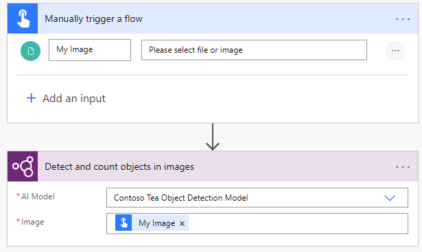
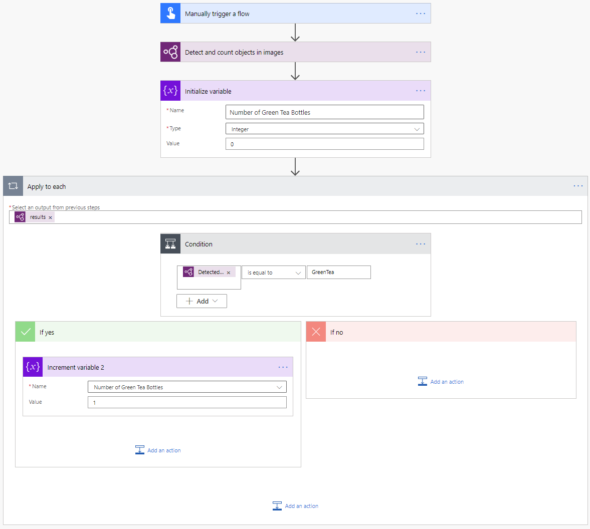

# Use the object detection model in Power Automate

1. Sign in to [Power Automate](https://flow.microsoft.com/).

1. Select **My flows** in the left pane, and then select **New flow** > **Instant cloud flow**.

1. Name your flow, select **Manually trigger a flow** under **Choose how to trigger this flow**, and then select **Create**.

1. Expand **Manually trigger a flow**, and then select **+Add an input** > **File** as the input type.

1. Replace  **File Content** with **My image** (also known as the title).

1. Select **+ New step** > **AI Builder**, and then select **Detect and count objects in images** in the list of actions.

1. Select the object detection model you want to use.

1. In the **Image** input, select **My Image** from the **Dynamic content** list:

    > [!div class="mx-imgBorder"]
    > 

1. To retrieve the name of the detected object or objects on the image:
   1. Select **New step**.
   1. Search for the successive action you want your flow to perform, for example add a row into an Excel table or send an email.
   1. Select any of the successive actions' inputs, and then select **Detected object name**  in the **Dynamic content** list.

Congratulations! You've created a flow that uses an object detection AI Builder model. Select **Save** on the top right, and then select **Test** to try out your flow.

## Example object detection flow

The following example shows the creation of a flow that is triggered by an image. This flow counts the number of green tea bottles in the image.

> [!div class="mx-imgBorder"]
> 

To learn more about the triggers and actions you can use, see the [Power Automate documentation](/flow/getting-started).

## Parameters
### Input
|Name |Required |Type |Description |Values |
|---------|---------|---------|---------|---------|
|**AI Model** |Yes |model |Object detection model to use for analysis|Trained and published object detection models |
|**Image** |Yes |file |Image to process| |

### Output
|Name |Type |Description |Values |
|---------|---------|---------|---------|
|**Detected object name** |string |The detected object name|Among the tags defined at model creation |
|**Detected object ID** |string |The detected object ID| |
|**Confidence score** |float |How confident the model is in its prediction |Value in the range of 0 to 1. Values close to 1 indicate greater confidence that the extracted value is accurate |
|**Coordinates height** |float |Coordinates left of the object| |
|**Coordinates left** |float |Coordinates left of the object| |
|**Coordinates top** |float |Coordinates top of the object| |
|**Coordinates width** |float |Coordinates width of the object| |

### See also

[Overview of the object detection model](object-detection-overview.md)

[!INCLUDE[footer-include](includes/footer-banner.md)]