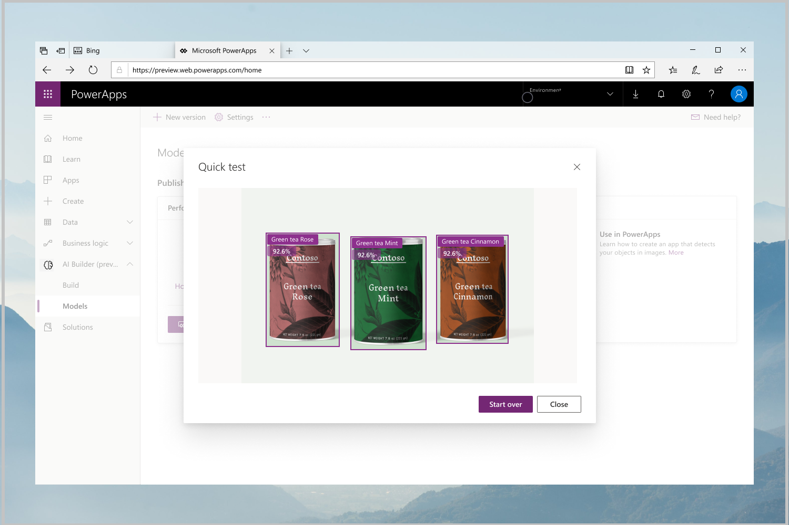

# Train and publish your object detection model

[!INCLUDE[cc-beta-prerelease-disclaimer](./includes/cc-beta-prerelease-disclaimer.md)]

In this section, you’ll learn how to verify your data, and then how to train, test, and publish your model.
1.	On the **Train your model** screen, verify that you have the correct names, and the correct amount of images 
2.	If the data is all good, Select **Train** to kick off the training of your object detection model.

## Quick test your model 

Once your model is trained, you can see it in action from its Details page, which you can learn more about [here](manage-model-ai-builder.md).
1.	From your model details page, select **Quick Test** button in the **Last trained version** section. 
2.	Drag and drop or upload an image which contains your objects to test your model.
3.	Your model will be applied to the image you uploaded. This step might take a little while.
4.	 After your model is done running, the rectangles found will be drawn directly on the picture. 

## Publish your object detection model

From there, you can run more tests with other pictures. If you are happy with the results you are getting, you can [publish](publish-model-ai-builder.md) your model to use it in a Powerapps or Microsoft Flow.

### Related topics
[Manage your AI model](manage-model-ai-builder.md)
