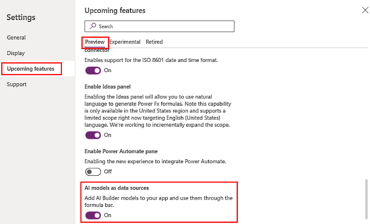
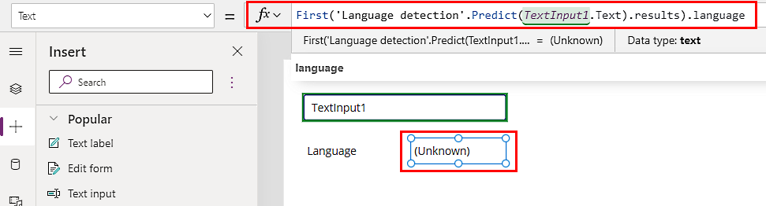
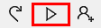
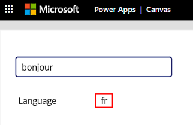

# Use Power Fx in AI Builder models in Power Apps (preview)

[!INCLUDE[cc-beta-prerelease-disclaimer](./includes/cc-beta-prerelease-disclaimer.md)]

Power Fx AI integration is a new approach that lets you reference AI models in any Power Apps control using the Power Fx formula language. If you've used [canvas apps](/powerapps/maker/canvas-apps/getting-started), you're already familiar with Power Fx. This is the same open-source low code formula language, only it's been updated so that you can use expressions to consume your AI Builder models. For example, you can modify the language your text appears in.

> [!IMPORTANT]
> - This is a preview feature.
>
> - [!INCLUDE[cc_preview_features_definition](includes/cc-preview-features-definition.md)]

## Requirements

To use Power Fx in AI Builder models, you must have:

- Dataverse access.

- AI Builder or trial version.

- (For non-preview models) Starter or purchased AI credits.

## Enable the Power Fx feature

The Power Fx feature is enabled by default in Microsoft Power Apps. If it's been disabled and you want to enable it again, you can do this in canvas apps.

1. Sign in to [Power Apps](https://make.powerapps.com).

1. Create a canvas app by selecting **Create** > **Canvas app from blank**.

    > [!div class="mx-imgBorder"]
    > 

1. In the **App name** field, enter a name and select **Create**.

1. If you see the **Welcome to Power Apps Studio** screen, select **Skip**.

1. On the toolbar at the top, select **Settings**.

    > [!div class="mx-imgBorder"]
    > 

1. Select **Upcoming features** > **Preview**.

1. Enable the **All data models as sources** feature by scrolling to the end  and selecting **On**.

    > [!div class="mx-imgBorder"]
    > 

## Select a model in canvas apps

Comsuming an AI model with Power Fx is similar to using a canvas app in that you'll need to create a canvas app, choose a control, assign an expression to it, and then create inputs produce the outputs. 

For a list of AI Builder models you can consume, go to [AI models and business scenarios](model-types.md). You can also consume models built in Microsoft Azure Machine Learning with the [bring your own model](byo-model.md) feature.

For alternative methods of using the formula to set behaviors of a control, go to [Use AI models in the formula bar](use-in-powerapps-overview.md#use-ai-models-in-the-formula-bar).

1. Create an app by following steps 1 through 4 in [Enable the Power Fx feature](#enable-the-power-fx-feature).

1. Select **Data tab** > **Add data** > **AI Models**.

    > [!div class="mx-imgBorder"]
    > 

1. Select one or more models to add.

    If you don’t see your model in this list, you might not have permissions to use it in Power Apps. Contact your administrator to resolve this.

## Use a model in controls

The canvas app in this language detection model example shows you the country code for the language of the text you type.

1. Create a canvas app by following steps 1 and 2 in [Select a model in canvas apps](#select-a-model-in-canvas-apps) (the previous procedure).

1. In the **AI models list**, select a language detection model.

1. Place a text input and a text label on the canvas:
    1. Select **+** > **Text input** and select where you want to place it on the canvas.
    1. Rename the text input to **TextInput1**.
    1. Select **+** > **Text label** and select where you want to place it on the canvas.
    1. Rename the text label to **Language**.

1. Select the **Text Input** field and enter the following Power Fx formula:

    ````powerapps-dot
    First('Language detection'.Predict(TextInput1.Text).results).language 
    ````

    > [!div class="mx-imgBorder"]
    > 

1. Try out your app by selecting the **Preview the app** icon in the upper-right corner.

    > [!div class="mx-imgBorder"]
    > 

1. In the textbox, type **bonjour**. Notice the country code for France (**fr**) appears above the textbox.

    > [!div class="mx-imgBorder"]
    > 

1. Try out your app again by typing **guten tag**. Notice the country code for Germany (**de**) appears above the textbox.

> [!NOTE]
> If you move your app to a different environment, the model must be manually re-added to the app in the new environment.

### Input/output examples

In this preview, every model is invoked using the *predict* verb. For example, a language detection model takes text as an input and returns a table of possible languages, ordered by that language’s score. The score says how likely the model thinks it is that the indicated language is correct.

|Input  |Output  |
|---------|---------|
|`'Language detection'.Predict("Bonjour").results`     | *(Caio will follow up.)*        |

To return the most likely language country code:

|Input  |Output  |
|---------|---------|
|`First('Language detection'.Predict("Bonjour").results).language`  | "fr" (country code for French)       |

To save time and resources, save the result of a model call so that you can use it in multiple places. You can save an output into a global variable (for example,  *lang*). If you do this, you can use *lang* elsewhere in your app, to show, for example, the national flag associated with the language.

|Input  |Output  |
|---------|---------|
|`Set(lang, First('Language detection'.Predict(TextInput1.OnChange).results).language)`       | (*Caio - Please verify the code in the **Input** column and add an output.*)
