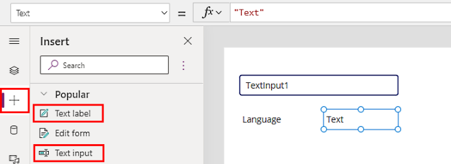

# Use AI Builder models in Power Apps

With the use of [Power Fx](/power-platform/power-fx/overview), the open-source low-code formulas, you can add more powerful and flexible integrations of AI models into your Power App. AI model prediction formulas can be integrated with any controls in canvas app. For example, you can detect the language of text in a text input control and output the results to a label control as can be seen in Use a model with controls section below.  

## Requirements

To use Power Fx in AI Builder models, you must have:

- Access to a [Microsoft Power Platform environment with a database](/power-platform/admin/create-environment#create-an-environment-with-a-database).

- AI Builder license (trial or paid). To learn more, go to [AI Builder licensing](administer-licensing.md).

## Select a model in canvas apps

To consume an AI model with Power Fx, you’ll need to create a canvas app, choose a control, and assign expressions to control properties.

> [!NOTE]
> For a list of AI Builder models you can consume, see [AI models and business scenarios](model-types.md). You can also consume models built in Microsoft Azure Machine Learning with the [bring your own model](byo-model.md) feature.

1. Create an app. More information: [Create a blank canvas app from scratch](/power-apps/maker/canvas-apps/create-blank-app).

1. Select **Data** > **Add data** > **AI models**.

    :::image type="content" source="media/powerfx-in-powerapps/data-sources.png" alt-text="Screenshot of how to select your model.":::

1. Select one or more models to add.

    If you don’t see your model in this list, you might not have permissions to use it in Power Apps. Contact your administrator to resolve this.

## Use a model with controls

Now that you've added the AI model to your canvas app, let’s see how to call an AI Builder model from a control.

In the following example, we’ll build an app that can detect the language entered by a user in the app.

1. Create an app. More information: [Create a blank canvas app from scratch](/power-apps/maker/canvas-apps/create-blank-app).

1. Select **Data** > **Add data** > **AI models**.

1. Search for, and select **Language detection** AI model.

    :::image type="content" source="media/powerfx-in-powerapps/language-detection.png" alt-text="Screenshot of language detection model.":::

1. Select **+** from the left-pane, and then select **Text input** control.

1. Repeat the previous step to add a **Text label** control.

1. Rename the text label to **Language**.

1. Add another text label next to the "Language" label.

    :::image type="content" source="media/powerfx-in-powerapps/app-controls.png" alt-text="App controls including text and both label controls.":::

1. Select the text label added in the previous step.

1. Enter the following formula in the formula bar for the text label's **Text** property.

    ```powerapps-dot
    'Language detection'.Predict(TextInput1.Text).Language
    ```


2.	Select Text label and place it on the canvas.
3.	Rename the text label to Language.
4.	Add another text label by selecting Text label and place it to the right of the Language text label.


1. In the **AI models list**, select a language detection model.

1. Place a text input and two text labels on the canvas:
    1. Select **+** > **Text input** and place it on the canvas.
    1. Rename the text input to **TextInput1**.
    1. Select **Text label** and place it on the canvas.
    1. Rename the text label to **Language**.
    1. Add another text label by selecting **Text label** and place it to the right of the **Language** text label.
     
    > [!div class="mx-imgBorder"]
    > 

1. Select the text label you added in step 3e and enter the following Power Fx formula:

    ````powerapps-dot
    First('Language detection'.Predict(TextInput1.Text).results).language 
    ````
    Notice that the label changes to **(Unknown)**.

    > [!div class="mx-imgBorder"]
    > 

1. Try out your app by selecting the **Preview the app** icon in the upper-right corner.

    > [!div class="mx-imgBorder"]
    > 

1. In the textbox, type **bonjour**. Notice that the country code for France (**fr**) appears below the textbox.

    > [!div class="mx-imgBorder"]
    > 

1. Try out your app again by typing **guten tag**. Notice the country code for Germany (**de**) appears below the textbox.

> [!NOTE]
> If you move your app to a different environment, the model must be manually re-added to the app in the new environment.

## Input/output by model type

This section provides inputs and outputs for custom and prebuilt models by model type. 

### Custom models

|Model type  |Input  | Output
|---------|---------|---------|
|Category classification | Language code, text. | `results` A table where each element has a type and a score. |
|Entity extraction |Language code, text. | `entities` A table where each element has a type, score, startIdx, length, and value (string represented from startIdx to startIdx+length). |
|Document processing |Document type (mime type string), document (base64 encoded string). | Four properties. `layoutName` (string), `layoutConfidenceScore` (number), `labels` (record containing the fields that can be identified in the form), and `tables` (record containing tables identified in the form). |
|Object detection |Image encoded as base64. | `results` A table with the different objects found in the picture. Each has a `boundingBox`, `confidence` value, and `tagId`. |
|Prediction | Properties defined when creating the model. Canvas receives these properties as a record. | A record with `Explanation`, `Likelihood`, and `Prediction` as properties. |

### Prebuilt models

|Model type  |Input  | Output
|---------|---------|---------|
| Business card reader | Image type (mime type), image encoded as base64. | `contact` Contains all possible fields that can be identified by the model, and `contactFields` (table that contains all identified fields in the input image, with `value`, `boundingBox`, `name`, and `parentName`). |
| Identity document reader | Image encoded as base64. | `result` A record that contains a fields property, which holds all possible fields from the model. Each field has value, location, and confidence information.  |
| Invoice processing | Image encoded as base64. | `result` A record that contains the fields and items properties, where `fields` is a record with all possible fields, and `items` is a table with identified items from the invoice.  |
| Key phrase extraction | Language code, text. | `results` A table of records that have a single property called `phrase`, which is the extracted key phrase. |
|Language detection  | Text |  `results` Results is a table where each element has a language and a score. |
| Receipt processing | Image encoded as base64. | `result` A record that contains the fields and items properties, where `fields` is a record with all possible fields, and `items` is a table with identified items from the invoice.  |
| Sentiment analysis | Language code, text. | `result` A record that contains `sentiment`, `documentScores`, and `sentences` properties. `sentiment` has the overall sentiment of the whole text input, `documentScores` are the computed "confidences" of each possible sentiment (positive, neutral, negative), and `sentences` is a table with the same results but at the sentence level. |
| Text recognition | Image encoded as base64. | `results` A table where each element has a lines table (with text and bounding box information). |
| Text translation | Language code for `translateTo`, language code for `translateFrom`, text | Text property (which contains translated input). | 

## Input/output examples

In this preview, every model is invoked using the *predict* verb. For example, a language detection model takes text as an input and returns a table of possible languages, ordered by that language’s score. The score indicates how confident the model is with its prediction.

|Input  |Output  |
|---------|---------|
|`'Language detection'.Predict("Bonjour").results`     | Table of possible languages, ordered by that language’s score.        |

To return the most likely language country code:

|Input  |Output  |
|---------|---------|
|`First('Language detection'.Predict("Bonjour").results).language`  | **fr** (country code for France)       |

To save time and resources, save the result of a model call so you can use it in multiple places. You can save an output into a global variable (for example,  *lang*). If you do this, you can use *lang* elsewhere in your app to show the identified language and its confidence score in two different labels.

|Input  |Output  |
|---------|---------|
|`Set(lang, First('Language detection'.Predict(TextInput1.OnChange).results))`       | Use these formulas:<br/>`lang.score`<br/>`lang.language`


### See also

[What are canvas apps?](/powerapps/maker/canvas-apps/getting-started)
