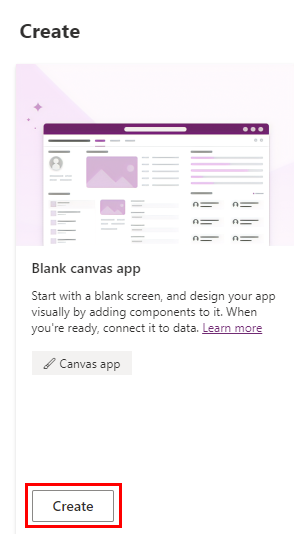
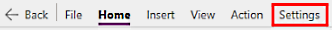
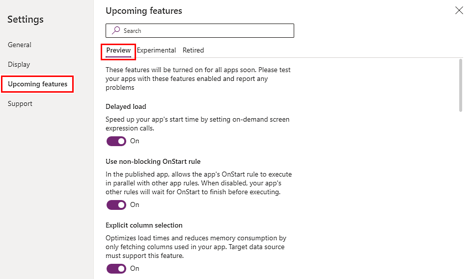
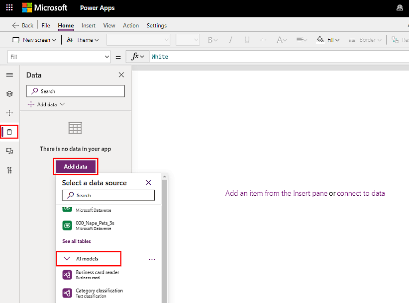

# Use Power Fx in AI Builder models in Power Apps (preview)

[!INCLUDE[cc-beta-prerelease-disclaimer](./includes/cc-beta-prerelease-disclaimer.md)]

Power Fx AI integration is a new approach that lets you reference AI models in any Power Apps control using the Power Fx formula language. If you've used [canvas apps](/powerapps/maker/canvas-apps/getting-started), you're already familiar with Power Fx. This is the same open-source low code formula language, only it's been updated so that you can use expressions to customize your AI Builder models. For example, you can modify the language your text appears in.

> [!IMPORTANT]
> - This is a preview feature.
>
> - [!INCLUDE[cc_preview_features_definition](includes/cc-preview-features-definition.md)]

## Requirements

To use Power Fx in AI Builder models, you must have:

- Dataverse access.

- AI Builder or trial version.

- (For non-preview models) Starter or purchased AI credits.

## Enable the Power Fx feature

The Power Fx feature is enabled by default in Microsoft Power Apps. If it's been disabled and you want to enable it again, you can do this in canvas apps.

1. Sign in to [Power Apps](https://make.powerapps.com).

1. Create a canvas app by selecting **Create** > **Canvas app from blank**.

    > [!div class="mx-imgBorder"]
    > 

1. In the **App name** field, enter a name and select **Create**.

1. If you see the **Welcome to Power Apps Studio** screen, select **Skip**.

1. On the toolbar at the top, select **Settings**.

    > [!div class="mx-imgBorder"]
    > 

1. Select **Upcoming features** > **Preview**.

1. Enable all features by selecting **On**.

    Make sure you scroll to the bottom to see all features. **All data models as sources** is the last feature and should be turned **On**.

1. (Optional) You can leave **Optimize for Microsoft Teams meetings** and **Enable Power Automate pane** in the **Off** position.

    > [!div class="mx-imgBorder"]
    > 

## Use an AI model with Power Fx

An AI model is similar to a canvas app and has its own inputs and outputs. You'll need to create a canvas app, choose a control, and then assign an expression to it. 

USing an AI model with Power Fx is similar to using a canvas app in that you'll need to create a canvas app, choose a control, assign an expression to it, and then create its inputs and outputs. 

For a list of AI Builder models you can use, go to [AI models and business scenarios](model-types.md). You can also customize models built in Microsoft Azure Machine Learning with the [bring your own model](byo-model.md) feature.

If you're in a production environment, there are alternative methods for using the formula bar that will allow you to set behaviors of a control. For details, go to [Use AI models in the formula bar](use-in-powerapps-overview.md#use-ai-models-in-the-formula-bar).

1. Create an app by following steps 1 through 4 in [Enable the Power Fx feature](#enable-the-power-fx-feature).

1. Select **Data tab** > **Add data** > **AI Models**.

    > [!div class="mx-imgBorder"]
    > 

1. Select one or more models to add.

### Use a model in controls

*(Ask Caio to walk me thru creating the app for screenshot.)*

> [!NOTE]
> If you move your app to a different environment, the model must be manually re-added to the app in the new environment.

## Input/output examples

In this preview, every model is invoked using the *predict* verb. For example, a language detection model takes text as an input and returns a table of possible languages, ordered by that language’s score. The score says how likely the model thinks it is that the indicated language is correct.

To.... (Ask Caio)

|Input  |Output  |
|---------|---------|
|'Language detection (preview)'.Predict("Bonjour").results     | *Ask Caio*        |

To return the most likely language countr code:

|Input  |Output  |
|---------|---------|
|First('Language detection (preview)'.Predict("Bonjour").results).language  | "fr" (country code for French)       |
|
