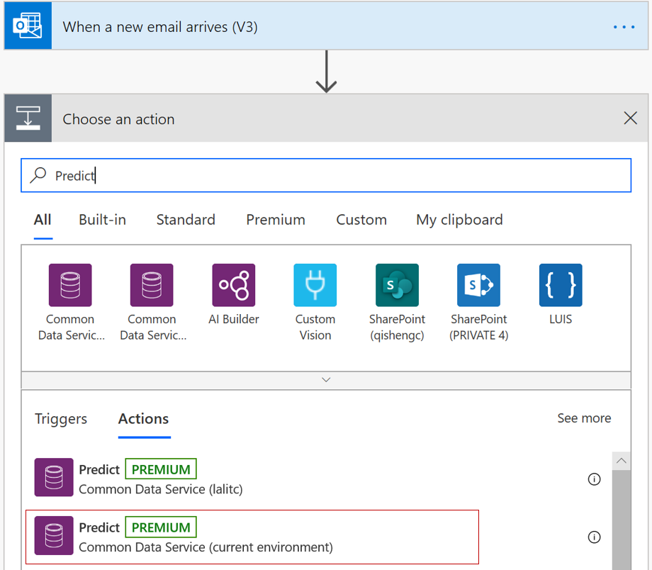
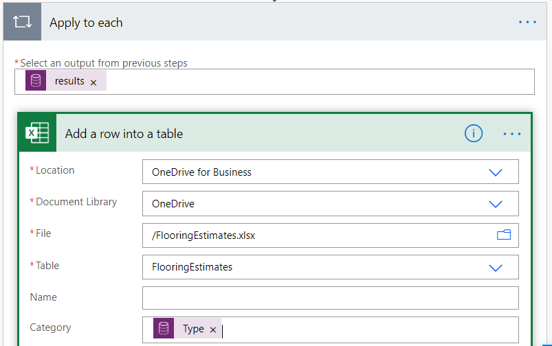

# Use prebuilt category classification model in Power Automate

[!INCLUDE[cc-beta-prerelease-disclaimer](./includes/cc-beta-prerelease-disclaimer.md)]

> [!IMPORTANT]
 > To use AI Builder models in Power Automate, you have to create the flow inside a solution. The steps below won't work if you don't follow these instructions first: [Create a flow in a solution](/flow/create-flow-solution).

1. Sign in to [Power Automate](https://flow.microsoft.com/), select the **My flows** tab, and then select **Automated-from blank**.

1. Search for *email*, select **When an email arrives** in the list of triggers, and then select **Create**.
1. Select **Text** and set as input title: **My Text**
1. Select **+ New step**, search for **html to text**, and then select **Html to text** in the list of actions.
1. Select the **Body** parameter.  This tells the category classification model to only analyze actual email text.

    > [!div class="mx-imgBorder"]
    > 

1. Select **+ New step**, search for *Predict*, and then select the  **Predict Common Data Service (current Environment)**  action.

    > [!div class="mx-imgBorder"]
    > 

1. Select **CategoryClassification Model**. In the sentence field select The **plain text** parameter.
1. Select **+ New Step** and search for **Add a row** and select the **Add a row into a table Excel**.
1. Locate your file by typing the file path, and insert results of **category classification (Type)** into a column of your choice.

    > [!div class="mx-imgBorder"]
    > 

Congratulations! You've created a flow that uses a prebuilt category classification AI Builder model. Select **Save** on the top right and then select **Test** to try out your flow.

To learn more about the triggers and actions, see [Get started with Power Automate](/flow/getting-started).

### Related topic

[Category classification model overview](text-classification-overview.md)
