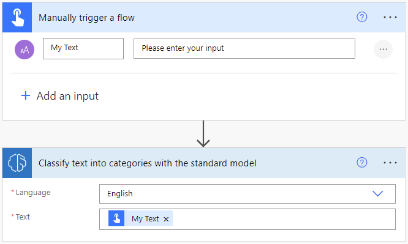
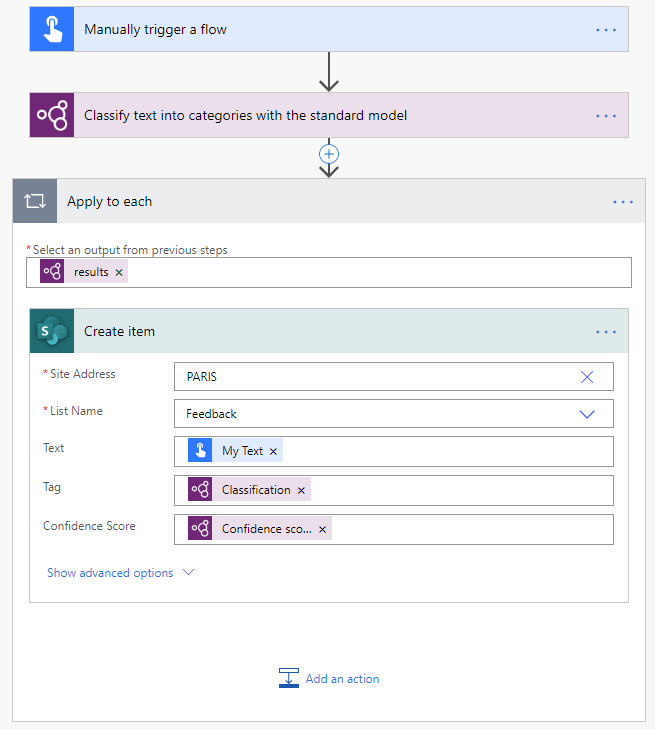

# Use the category classification prebuilt model in Power Automate

1. Sign in to [Power Automate](https://flow.microsoft.com/).

1. Select **My flows** in the left pane, and then select **New flow** > **Instant cloud flow**.

1. Name your flow, select **Manually trigger a flow** under **Choose how to trigger this flow**, and then select **Create**.

1. Expand **Manually trigger a flow**, and then select **+Add an input** > **Text** as the input type.

1. Replace  **Input** with **My Text** (also known as the title).

1. Select **+ New step** > **AI Builder**, and then select **Classify text into categories with the standard model** in the list of actions.

1. Select the language in the **Language** input and specify the **My Text** column from the trigger in the **Text** input.

    > [!div class="mx-imgBorder"]
    > 

1. In the successive actions, you can use any columns and tables extracted by the AI Builder model. The following example, saves each inferred **Classification** and **Confidence score** into a SharePoint list.

    > [!div class="mx-imgBorder"]
    > 

Congratulations! You've created a flow that uses an AI Builder prebuilt category classification model. Select **Save** on the top right and then select **Test** to try out your flow.

## Parameters

### Input
|Name |Required |Type |Description |Values |
|---------|---------|---------|---------|---------|
|**Text** |Yes |string |Text to analyze|Text sentences |
|**Language** |Yes |string |Language of the text to analyze|List of predefined languages or language code (ex.: "en", "fr", "zh_chs", "ru") |

Congratulations! You've created a flow that uses a prebuilt category classification AI Builder model. Select **Save** on the top right, and then select **Test** to try out your flow.

### Output

|Name |Type |Description |Values |
|---------|---------|---------|---------|
|**Classification** |string |Entity identified|Issues, compliment, customer service, documentation, price & billing, staff |
|**Confidence score** |float |How confident the model is in its prediction|Value in the range of 0 to 1. Values close to 1 indicate greater confidence that the extracted value is accurate |

### See also

- [Training: Get started with AI Builder category classification (module)](/training/modules/ai-builder-category-classification/)
- [Category classification prebuilt model](prebuilt-category-classification.md)

[!INCLUDE[footer-include](includes/footer-banner.md)]