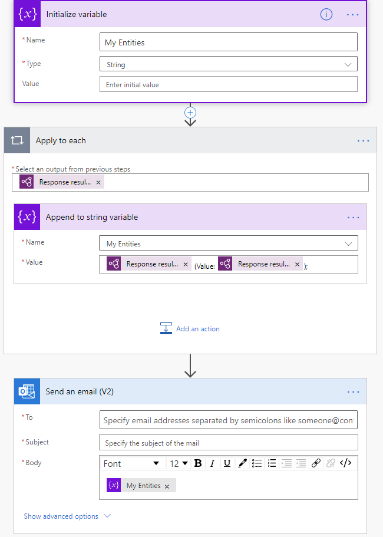

# Use the entity extraction prebuilt model in Power Automate

[!INCLUDE[cc-beta-prerelease-disclaimer](./includes/cc-beta-prerelease-disclaimer.md)]

> [!IMPORTANT]
 > To use AI Builder models in Power Automate, you have to create the flow inside a solution. The steps below won't work if you don't follow these instructions first: [Create a flow in a solution](/flow/create-flow-solution).

1. Sign in to [Power Automate](https://flow.microsoft.com/), select the **My flows** tab, and then select **New > +Instant-from blank**.
1. Name your flow, select **When an email arrives** in the list of triggers, and then select **Create**.
1.	Select **+ New step**, search for *html to text*, and then select **Html to text** in the list of actions. 
1. Select + New step, search for the term **AI Builder**, and then select **Extract entities and their types from text** in the list of actions.
1. In the **Text** field select the **plain text** parameter:

   > [!div class="mx-imgBorder"]
   > 

1. In the successive actions, you can use any fields extracted by the AI Builder model. For example, you can send an email using the "Entities type" and "Entities value" in the body of your email:
   > [!div class="mx-imgBorder"]
   > 

Congratulations! You've created a flow that uses an entity extraction model. Select **Save** in the upper-right corner, and then select **Test** to try out your flow.

### See also

[Entity extraction prebuilt model](prebuilt-entity-extraction.md)  
[AI Builder in Power Automate overview](use-in-flow-overview.md)

