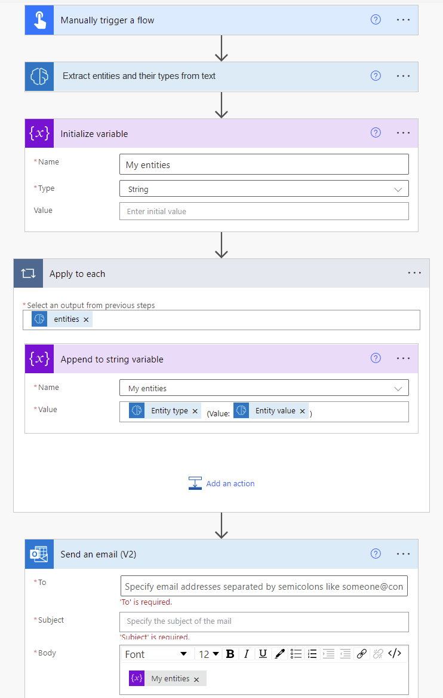

# Use the entity extraction prebuilt model in Power Automate

1. Sign in to [Power Automate](https://flow.microsoft.com/), select the **My flows** tab, and then select **New > +Instant-from blank**.
1. Name your flow, select **When an email arrives** in the list of triggers, and then select **Create**.
1.	Select **+ New step**, search for *html to text*, and then select **Html to text** in the list of actions. 
1. Select + New step, search for the term **AI Builder**, and then select **Extract entities and their types from text** in the list of actions.
1. In the **Text** field select the **plain text** parameter.

   > [!div class="mx-imgBorder"]
   > 

1. In the successive actions, you can use any fields extracted by the AI Builder model. For example, you can send an email using the **Entity type** and **Entity value** fields.
   > [!div class="mx-imgBorder"]
   > 
   
Congratulations! You've created a flow that uses an entity extraction model. Select **Save** in the upper-right corner, and then select **Test** to try out your flow.

## Parameters
### Input
|Name |Required |Type |Description |Values |
|---------|---------|---------|---------|---------|
|**Text** |Yes |string |Text to analyze|Text sentences |
|**Language** |Yes |string |Language of the text to analyze|List of predefined languages or language code (ex.: "en", "fr", "zh_chs", "ru") |

### Output
|Name |Type |Description |Values |
|---------|---------|---------|---------|
|**Entity type** |string |Type of the entity|Example: DateTime or Organization |
|**Entity value** |string |Content of the entity|Example: June 1 or Contoso |
|**Confidence score** |float |How confident the model is in its prediction|Value in the range of 0 to 1. Values close to 1 indicate greater confidence that the extracted value is accurate |
|**Starting location** |integer |Where the entity's first character appear in the line| |
|**Character count** |integer |How long the entity is| |

### See also

[Entity extraction prebuilt model](prebuilt-entity-extraction.md)  
[AI Builder in Power Automate overview](use-in-flow-overview.md)
