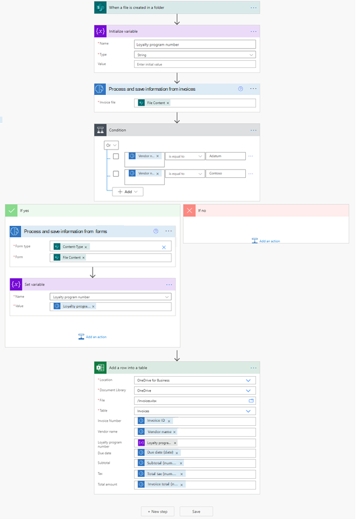

# Use invoice processing in Power Apps (preview)

[!INCLUDE [cc-beta-prerelease-disclaimer](includes/cc-beta-prerelease-disclaimer.md)]

Currently, there is no invoice processing control available for canvas apps in Power Apps. But you can have an app that calls a Power Automate flow that uses the invoice processing prebuilt AI model, and then returns the results back to your app. The following example shows you how you can achieve this:

1. Sign in to [Power Automate](https://flow.microsoft.com).
1. Make sure you are in the same Power Platform environment where you will have your canvas app. Check the environment on the top right of the page. Next select **My flows** in the left-side navigation pane.
1. Select **New** > **Instant – from blank**.
1. Name your flow: “Invoice processing flow”, then select **Power Apps** under **Choose how to trigger this flow**.
1. Select **Create**.
1. Select **+ New step**, search for AI Builder, and then select **Process and save information from invoices** in the list of actions.
1. Select the **Invoice file** input and then select **Ask in Power Apps** in the **Dynamic content** menu.
   > [!div class="mx-imgBorder"]
   > 
