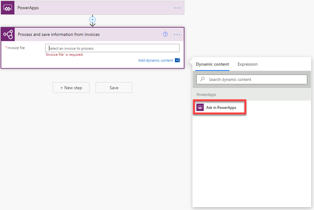
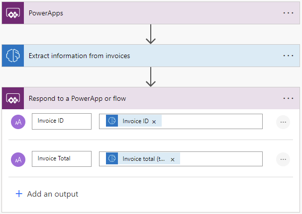
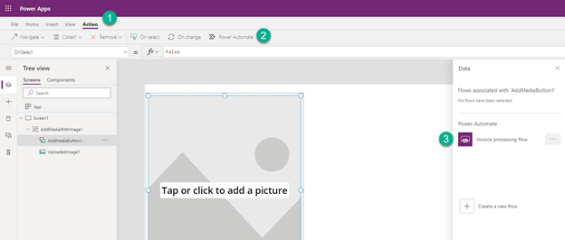
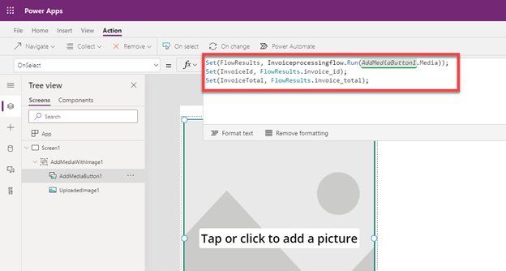
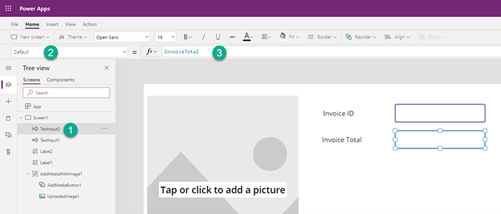
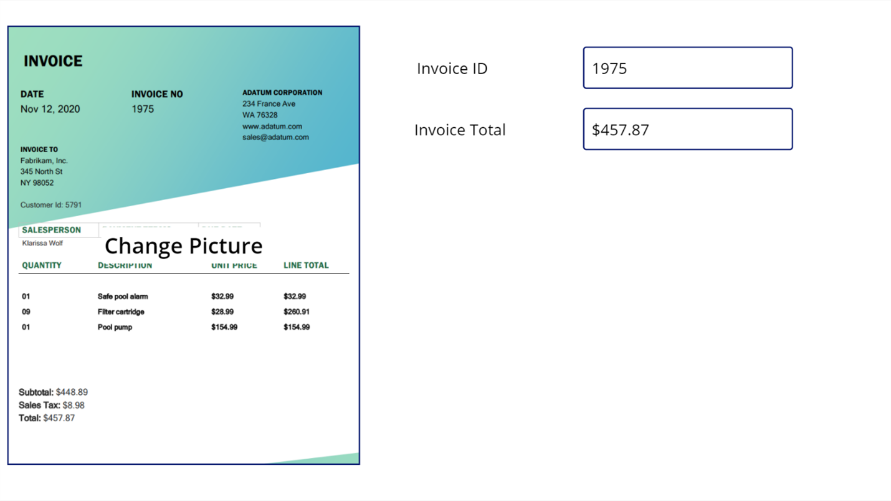

# Use invoice processing in Power Apps

Currently, there is no invoice processing control available for canvas apps in Power Apps. But you can create an app that calls a Power Automate flow that uses the invoice processing prebuilt AI model, and then return the results back to your app. The following example shows how to do this:

## Build your flow

1. Sign in to [Power Automate](https://flow.microsoft.com).

1. Make sure you are in the same Power Platform environment where you will have your canvas app. Check the environment on the top right of the page.

1. Select **My flows** in the left-side navigation pane.

1. Select **New flow** > **Instant cloud flow**.

1. Name your flow “Invoice processing flow”, and then select **Power Apps** under **Choose how to trigger this flow**.

1. Select **Create**.

1. Select **+ New step** > **AI Builder**, and then select **Extract information from invoices** in the **Actions** list.

1. Select the **Invoice file** input and then select **Ask in Power Apps** in the **Dynamic content** list.

   > [!div class="mx-imgBorder"]
   > 

1. Select **+ New step**, search for *respond to a powerapp*, and then select **Respond to a PowerApp or flow** in the **Actions** list.

   For this example we’re going to add two text outputs: *Invoice ID* and *Invoice Total*. You might want to add more or different outputs based on the extracted invoice fields you want to send back to your canvas app.

   To add the inputs:

   1. Select **+Add an output** > **Text**. 

   1. Replace **Enter title** with **Invoice ID**.

   1. Select the new **Invoice ID** input, and then select **Invoice ID** from the **Dynamic content** list.

   1. Select **+ Add an input** > **Text**.

   1. Replace **Enter title** with **Invoice Total**.

   1. Select the new **Invoice Total** input, and then select **Invoice total (text)** from the **Dynamic content** list.

      > [!div class="mx-imgBorder"]
      > 

1. Save your flow.

## Build your canvas app

1. Sign in to [Power Apps](https://make.powerapps.com/). 
1. Make sure you are on the same Microsoft Power Platform environment where you created the flow on the top right of the page. 
1. Select **+Create** in the left-side navigation pane.
1. Select the **Canvas app from blank** tile. 
1. Name your app, select either **Tablet** or **Phone** format, and then select **Create**.
1. In the app editor, select **Insert** > **Media** > **Add picture** to insert a control into your app where users can upload a picture from a device or camera.
1. Select the **AddMediaButton1** control on the left. 
1. On the formula bar on the top, select the **OnSelect** event.

1. Select the **Action** menu and select **Power Automate**. Choose the flow that we created in the previous steps. If you don’t see the flow, make sure you are on the same Power Platform environment as where you created the flow, you can check the environment on the top right of the page.
   > [!div class="mx-imgBorder"]
   > 

1. Enter the following formula on the **OnSelect** event for the **AddMediaButton1** control. This formula tells the app to call the flow we’ve built once a new image is uploaded and saves the results we received from the flow in variables.

   The name of the variables and name of your flow might be different depending on how you configured it when building the flow:

   > *Set(FlowResults, Invoiceprocessingflow.Run(AddMediaButton1.Media));*
   >
   > *Set(InvoiceId, FlowResults.invoice_id);*
   >
   > *Set(InvoiceTotal, FlowResults.invoice_total);*

   > [!div class="mx-imgBorder"]
   > 

1. Now let’s add two labels and two text inputs to display the results we will get from the flow. Change the Default property for each text input to take the values from the variables we have defined in the previous step.
   > [!div class="mx-imgBorder"]
   > 

1. The app is now ready to run! Select the **Play** icon on the top right to test it.
   > [!div class="mx-imgBorder"]
   > 

[!INCLUDE[footer-include](includes/footer-banner.md)]
