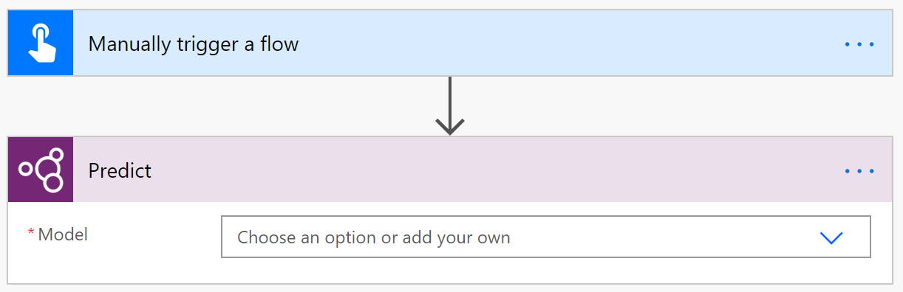
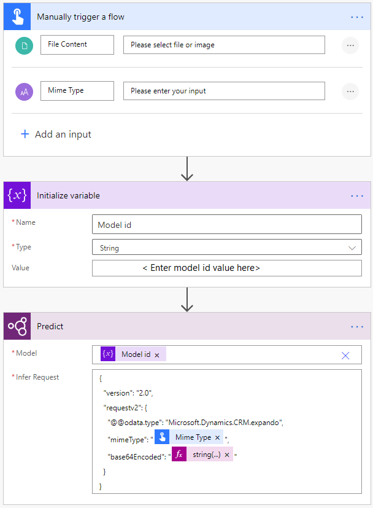
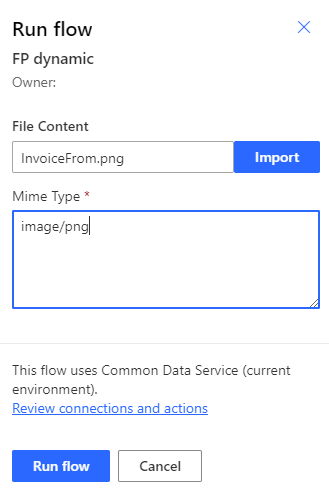
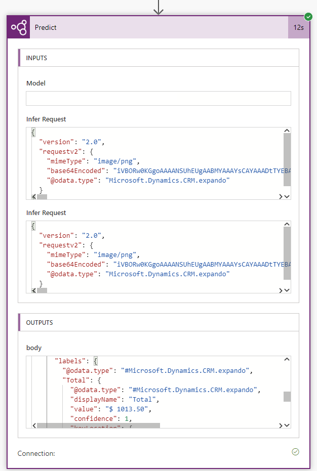
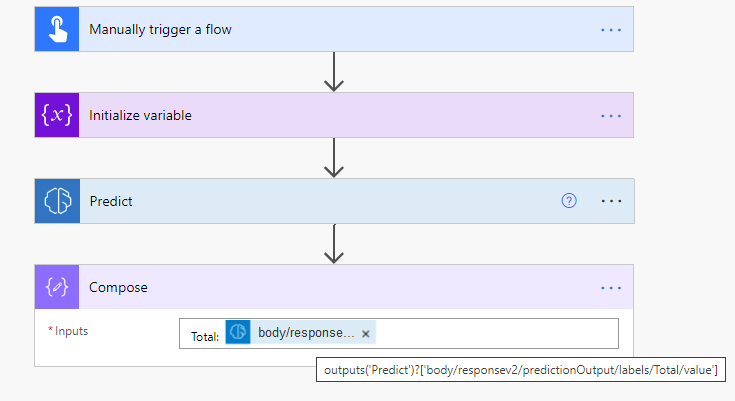

# Use predict action in Power Automate

You can use dedicated actions for each AI Builder model in Power Automate. However, the **predict** action lets you use many AI Builder model types.

## Use a custom or prebuilt model

1. Sign in to [Power Automate](https://flow.microsoft.com/).

1. Select **My flows** in the left pane, and then select **New flow** > **Instant cloud flow**.

1. Name your flow, select **Manually trigger a flow** under **Choose how to trigger this flow**, and then select **Create**.

1. Select **+ New step**, and then enter **predict** in the search bar.

1. Select **Predict from AI Builder** or **Predict using AI Builder models from Microsoft Dataverse**. Both actions offer the same features.

    > [!div class="mx-imgBorder"]
    > 

1. In the **Model** input, select a custom model you created or choose a prebuilt model. Here is the list of the prebuilt models available:
   - Business card reader: BusinessCard model
   - Category classification (prebuilt): Category/Classification model
   - Entity extraction (prebuilt): EntityExtraction model
   - Key phrase extraction: KeyPhraseExtraction model
   - Language detection: LanguageDetection model
   - Sentiment analysis: SentimentAnalysis model
   - Text recognition: TextRecognition model

>[!NOTE]
>
>To learn more about the input and output parameters of each model, refer to the documentation explaining how to use the selected model in the following documentation sections:
>- Use a custom AI Builder model in Power Automate
>- Use a prebuilt AI Builder model in Power Automate

## Use a dynamic model ID (advanced)

For some complex use cases, you may need to pass a model ID dynamically to the predict action. For example, if you want to process different types of invoices using different models, you may want to automatically choose a model depending on the type of invoice.

In this section, we'll explain how to configure the AI Builder predict action for this specific purpose depending on the model type.

1. Sign in to [Power Automate](https://flow.microsoft.com/).

1. Select **My flows** in the left pane, and then select **New flow** > **Instant cloud flow**.

1. Name your flow, select **Manually trigger a flow** under **Choose how to trigger this flow**, and then select **Create**.

1. Select **+ New step**.

1. Enter **Initialize variable** in the search bar, and then select it in the **Actions** tab.

1. Enter **model id** in the **Name** input, **String** in the **Type** input, and the actual model ID in the **Value** input.

   The model ID can be found in the URL of the model's detail page in Power Apps:
   *make.powerapps.com/environment/[environment id]/aibuilder/models/**[model id]***

1. Select **+ New step**, search for **predict** and then select **Predict from AI Builder**.

1. Select the input > **Enter custom value**, and then enter **model id** from step 6.

   The **Infer request** column value depends on the model type.

### Form processing model

1. In the step **Manually trigger a flow**, add a **File** input, and set its name to **File Content**.
1. In the step **Manually trigger a flow**, add a **Text** input, and set its name to **Mime Type**.
1. In the step **Initialize variable**, enter a form processing model ID.
1. In the step **Predict**, enter following value in the **Infer request** column:

    ```json
    {
        "version": "2.0",
        "requestv2": {
        "@@odata.type": "Microsoft.Dynamics.CRM.expando",
        "mimeType": "@{triggerBody()['text']}",
        "base64Encoded": "@{string(triggerBody()?['file']?['contentBytes'])}"
        }
    }
    ```

    > [!div class="mx-imgBorder"]
    > 

1. Select **Save** in the upper-right corner, and then select **Test** to try out your flow:

    > [!div class="mx-imgBorder"]
    > 

1. In the flow run details, get the model JSON output in the **OUTPUTS** section of the predict action. This output is useful to build downstream actions using values of the model.

    > [!div class="mx-imgBorder"]
    > 

1. Go back to your flow in edit mode. 

1. Select  **+ New step** and select the **Compose** action (or any other action to process your model output). Let's say your model output has the **Total** column. You can get it with the following formula:

    ```
    @{outputs('Predict')?['body/responsev2/predictionOutput/labels/Total/value']}
    ```

    > [!div class="mx-imgBorder"]
    > 


### Object detection model

This process is similar to the infer request in step 4 in the *Form processing model* section:

```json
{
    "version": "2.0",
    "requestv2": {
        "@@odata.type": "Microsoft.Dynamics.CRM.expando",
        "base64Encoded": "@{string(triggerBody()?['file']?['contentBytes'])}"
    }
}
```

### Category classification model

This process is similar to the infer request in step 4 in the *Form processing model* section:

```json
{
    "version": "2.0",
    "requestv2": {
        "@@odata.type": "Microsoft.Dynamics.CRM.expando",
        "language": "Detect automatically",
        "text": "The text to categorize"
    }
}
```

[!INCLUDE[footer-include](includes/footer-banner.md)]