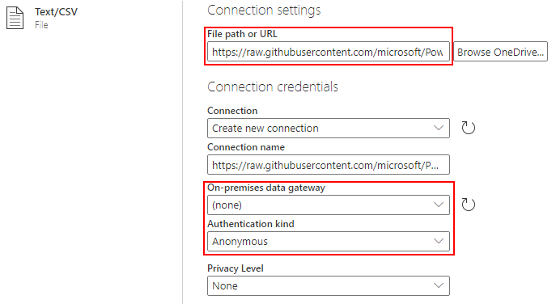
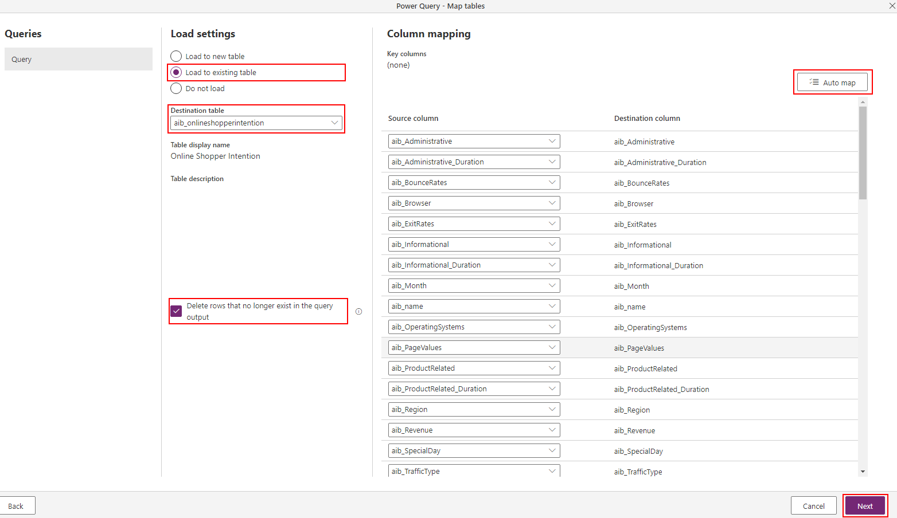
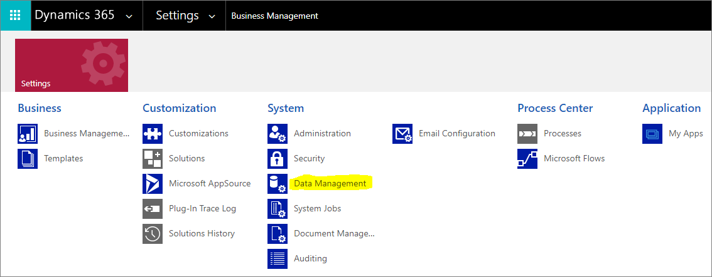
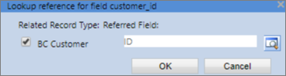

# Data preparation

Before you create your prediction model, you'll want to make sure your data is in Microsoft Dataverse and that it's in the correct format.

## Create your custom table

Do you have data that you want to import into Dataverse for training in AI Builder? First, you have to create a table. In this example, we'll provide a solution that has predefined custom tables. To use your own data, [create a custom table](/powerapps/maker/common-data-service/data-platform-create-entity) and substitute your own table for the example used here.

> [!NOTE]
>For best results, use a dataset that is less than 1.5 GB in size. Otherwise, AI Builder uses only 1.5 GB of your data to train and predict. Since you can’t control which data exceeding the 1.5 GB limit is not used, you should optimize your data to stay under 1.5 GB.

## Example dataset for binary prediction and numerical prediction

Use the following dataset if you want to predict true/false outcomes, or for numerical prediction.

1. Download the AI Builder sample datasets solution: [AIBuilderOnlineShopperIntention_1_0_0_0.zip](https://go.microsoft.com/fwlink/?linkid=2093415).

1. In Power Apps, select **Solutions** in the left pane, and then select **Import** at the top of the screen.

1. In the pop-up window, select **Browse**.

1. Select **AIBuilderOnlineShopperIntention_1_0_0_0.zip**, which you downloaded in step 1, select **Open**, and then click **Next**.

1. Read the details and then select **Import**.

1. Follow the on-screen instructions to import the solution, and then select **Close** after you finish.

Next, import the sample data into the table. In this example, we use the **aib_onlineshopperintention.csv** file.

1. In the list of [AI Builder samples](https://go.microsoft.com/fwlink/?linkid=2093415), select the **aib_onlineshopperintention.csv** file, and then select **Download** to open the raw version of the file.

1. Copy the URL from the address bar in your browser. In this case, the URL to copy is: https://raw.githubusercontent.com/microsoft/PowerApps-Samples/master/ai-builder/aib_onlineshopperintention.csv

1. In Power Apps, select **Tables** in the left pane under Data, select **Data** > **Get data** from the menu at the top, select **Text/CSV**, and then paste the copied URL from the last step into the **File path  or URL** box.

1. Set the following properties:

    - **On-premises data gateway** = *(none)*
    - **Authentication kind** = *Anonymous*
 
    > [!div class="mx-imgBorder"]
    > 

1. Select **Next**.

1. Review the file data, select **Transform data**, and then select **Next**.

1. On the **Map tables** screen, make sure **Load to existing table** is selected, and under **Destination table**, select **aib_onlineshopperintention** in the drop-down menu.

1. Select the **Delete rows that no longer exist in the query output** check box.

1. Select the **Automap** function in the upper-right corner of the **Field-mapping** screen, and then select **Next**.

    > [!div class="mx-imgBorder"]
    > 

1. On the **Refresh settings** screen, select the **Refresh manually** check box, and then select **Create** to start the import process.

Allow some time for the import to be completed. Then make sure the data is imported correctly.

1. In Power Apps, go back to **Tables** under **Data**, and select **Online Shopper Intention**.

1. Select **Views**, and then select **Active Online Shopper Intention**.

1. Select **New table column**, enter a table name, and them select **Done** to add a column to validate that all the columns have been imported correctly.

1. Select **Publish** to save the current view with the selected fields.

And you're done!

## Example dataset for predicting multiple outcomes

1. In the list of AI Builder samples, download the AI Builder sample datasets solution: [BrazilianCommerce_1_0_0_4_managed.zip](https://go.microsoft.com/fwlink/?linkid=2093415)

1. In Power Apps, select **Solutions** in the left pane, and then select **Import** at the top of the screen.

1. In the pop-up window, select **Browse**, select **BrazilianCommerce_1_0_0_4_managed.zip**, which you downloaded in step 1, and then select **Next**.

1. Select **Import** and follow the on-screen instructions to import the solution, and then select **Close** after you finish.

1. Download **customer.csv**, **order.csv**, and **product.csv** from AI Builder samples.

   After the solution is imported, select the gear icon in the upper-right corner of the Power Apps screen, and then select **Advanced settings**.

1. Select **Settings**, and then select **Data Management**.

   > [!div class="mx-imgBorder"]
   > 

1. Select **Imports** from the top menu bar.

1. In the **Data file name** section, select **customer.csv**, and then select **Next**.

1. Select **Next** until you get to the **Map Record Types** screen.

1. Select **BC Customer** from the drop-down menu, and then select **Next**. Map the columns as shown in the following table.<!--Style Guide wants it to be "ZIP code." Would changing it break anything? -->

    |**Source column**|**Map to**|
    |:-----|:-----|
    |customer\_id|ID |
    |customer\_city|City |
    |customer\_state|State |
    |customer\_zip\_code\_prefix|Zip code |

1. Select **Next**, select **Submit**, and then select **Finish**.

1. Repeat the process, but this time use **product.csv** and map it to **BC Product**. Map the columns as shown in the following table. 

    |**Source column**|**Map to**|
    |:-----|:-----|
    |product\_id|ID |
    |product\_category\_name|Category |
    |product\_description\_lenght|Description Length |
    |product\_height\_cm|Height cm |
    |product\_length\_cm|Length cm |
    |product\_name\_lenght|Name Length |
    |product\_photos\_qty|Photos Quantity |
    |product\_weight\_g|Weight g |
    |product\_width\_cm|Width cm |

  Wait until both of these imports are complete before moving on to the next step.

14. Repeat the process, but this time use **order.csv** and map it to **BC Order**. Map the columns like this:

    |**Source column**|**Map to**|
    |:-----|:-----|
    |order\_id|ID  |
    |customer\_id|Customer (Lookup) |
    |freight\_value|Freight Value |
    |order\_delivered\_customer\_date|Delivered Date |
    |order\_estimated\_delivery\_date|Estimated Delivery Date |
    |order\_purchase\_timestamp|Purchase Date |
    |order\_status|Order Status |
    |price|Price |
    |product\_id|Product (Lookup) |

In the **Lookup reference** dialog box, make sure that the check box is selected and that the column is **ID**.

   > [!div class="mx-imgBorder"]
   > 

And you're done!

### Next step

[Create a prediction model](prediction-create-model.md)

[!INCLUDE[footer-include](includes/footer-banner.md)]