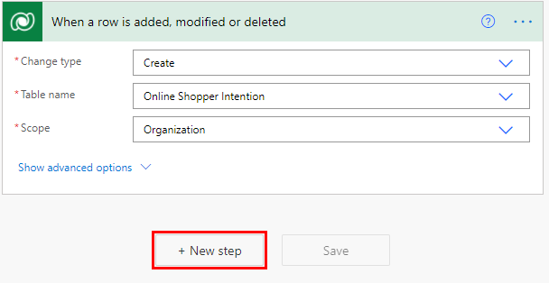

# Use a prediction model in Power Automate

[!INCLUDE[cc-beta-prerelease-disclaimer](./includes/cc-beta-prerelease-disclaimer.md)]

> [!IMPORTANT]
 > To use AI Builder models in Power Automate, you have to create the flow inside a solution. The steps below won't work if you don't follow these instructions first: [Create a flow in a solution](/flow/create-flow-solution).

To use real-time prediction in Power Automate. Follow these steps to build a flow:

1. Sign in to [Power Automate](https://flow.microsoft.com/).
1. On the Flows tab, click "New" and select the type. (sample is from "Automated - from blank")
1. Select the desired trigger and then select create.
1. Configure trigger and add any additional steps to prep data.

> [!div class="mx-imgBorder"]
> 

1. Add the "Predict" action. 
1. Complete all fields using your data, or data from previous steps in the flow.
1. Update the record with prediction output.

Congratulations! You have created a flow that uses the real-time prediction feature in AI Builder

### Related information

[Use your prediction model](prediction-use.md)

[Train your model](train-model.md)

[Publish your model](publish-model.md)
