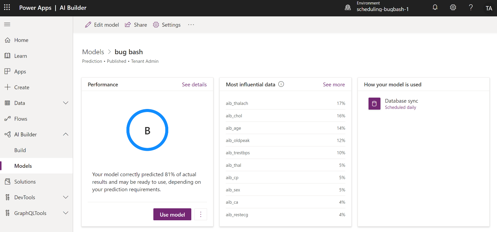
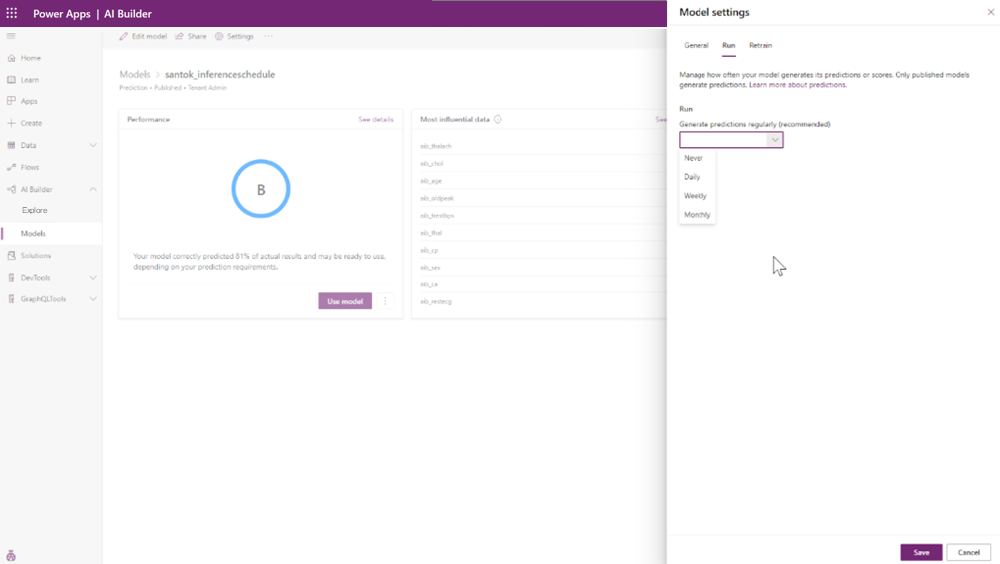

# Use your prediction model

After your model is trained and published, it's ready for you to use. 

## Run your prediction model

To run your prediction model, go to the model settings page and select **Run now**.

## Schedule retrain and run (preview)

[!INCLUDE[cc-beta-prerelease-disclaimer](./includes/cc-beta-prerelease-disclaimer.md)]

You can use the schedule retrain feature to train prediction models so that their performance doesn't degrade over time. Users can use the schedule run feature to infer records based on their own conditions and app use. This helps users to use AI Builder units more effectively.

For example, if your data changes weekly, you can schedule the model to train on a weekly basis. It doesn't make sense to keep inferring the same data every day, so you'd probably schedule weekly inference to align with the training schedule.

Open the **Schedule** screen from the model detail page under **Database Sync**. Alternatively, select the **Settings** tab in the menu bar on the model details page.

> [!div class="mx-imgBorder"]
> 

When you select the link under **Database Sync**, the screen below lists schedule options for **Run**. Switch between the **Run** and **Retrain** tabs to view or modify their respective schedules.

> [!div class="mx-imgBorder"]
> 

You can set the run or retrain cadence to daily, weekly, or monthly. If you don't want to run prediction or retrain at this time, you can set it to **Never**. Other reasons to set the cadence to **Never**<!--Suggested--> might be that you have data issues upstream and don't want to negatively affect<!--Via Writing Style Guide.--> business processes, or you simply<!--Suggested.--> don't want to use the model.

> [!NOTE]  
> When you schedule your model to retrain, it creates a flow to schedule the training. It's a good idea not to update the flow associated with the AI Builder retrain schedule. AI Builder manages the flow through the schedule retrain experience.

If you make any changes to the AI Builder **Schedule** > **Retrain** settings, the associated flow is replaced with a new one.

## Real-time prediction (preview)

[!INCLUDE[cc-beta-prerelease-disclaimer](./includes/cc-beta-prerelease-disclaimer.md)]

In addition to scheduled prediction inferences, AI Builder supports real-time prediction. Although scheduled prediction on a daily cadence might work for some scenarios, there are times when prediction needs to run in real time. Let's say that your retail company wants to know whether an order will be delivered on time. If the order creation and fulfillment processes occur in a short timeframe, you need the delivery prediction during the fulfillment process. Then you can decide whether to use a faster shipment type. Real-time prediction provides you the information at the time you need it.

AI Builder prediction models created after April 2, 2020, are enabled for real-time prediction. A real-time prediction for a model is a synchronous call to AI Builder. AI Builder supports real-time prediction by value and real-time prediction by reference. The predict operation accepts a single input observation in the request payload and returns the prediction synchronously in the response.

### What about existing models?

Prediction models created before April 2, 2020, don't support real-time prediction. Re-create any models created before this date to use real-time prediction capability.

### How to use real-time prediction

To use real-time prediction, create a flow in Power Automate. More information: [Use a prediction model in Power Automate](prediction-pwr-automate.md)

### See also

[Train your model in AI Builder](train-model.md)  
[Publish your model in AI Builder](publish-model.md)
