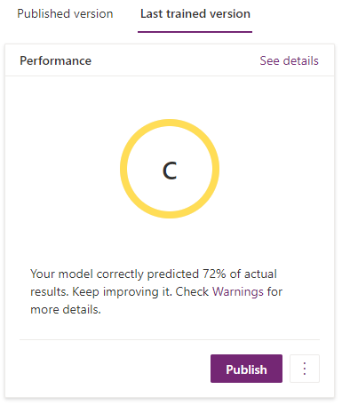

# Publish model

After you successfully train your model, you have to publish it if you want to make it available. All users in your current environment will be able to use your published model when you publish it.

On the details page, under **Last trained version**, select **Publish**.

> [!div class="mx-imgBorder"]
> 

After you publish your last trained version, it appears as the published version. For certain AI model types, you might need to take additional steps to use your model in Power Apps or Common Data Service.

> [!NOTE]
>
> - Any previous published version is overwritten when you publish a new version.
> - If you have a published version and a last trained version, you will lose the published version when you unpublish because the last trained version is more recent.

## When should I publish my model?

Publish your model when you want to make it available to users in your Power Apps environment. If you are not satisfied with your model, you can create a new version to try to yield better results. For information about how to create a new version, go to the [Manage a model in AI Builder](manage-model.md) section.

If you are satisfied with your model, you can publish it to make it available. Similarly, because you can only have up to two trained versions available at a time, you can publish a version if you do not want it to be overwritten by a new version.

### Related topics

[Use AI Builder in Power Automate](use-in-flow-overview.md)

[Use AI Builder in Power Apps](use-in-powerapps-overview.md)
