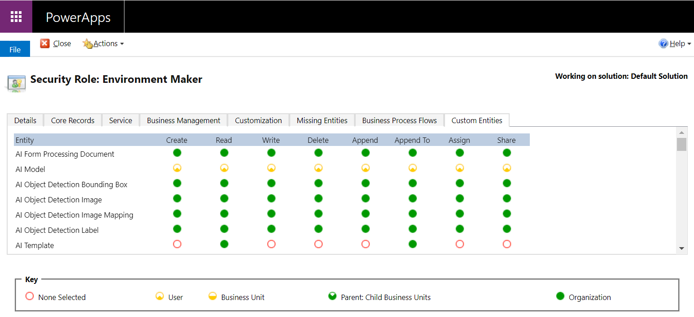

# Roles and security in AI Builder

AI Builder relies on environment security and Microsoft Dataverse security roles and privileges to grant access to AI features in Microsoft Power Apps. For more information, see [Security overview](/power-platform/admin/wp-security).

Some privileges are set by default in Dataverse. This allows built-in security roles to use AI Builder without further actions from system administrators. Specifically:

- Environment Makers can use AI Builder to create AI models.
- Basic Users can access data by using the models embedded in Power Apps.
- System Administrators and System Customizers can access all AI models created in the environment.

These security roles have privileges to the AI Builder tables in Dataverse. Custom security roles can create AI models if they have the same access to the AI Builder tables as the Environment Maker role.

> [!div class="mx-imgBorder"]
> 

Scenarios such as object detection, category classification, and prediction need read access to Dataverse tables. Make sure Environment Makers have access to them. They need those tables for objects to detect, tagged text, and input data.

Some features need System Customizer privileges to publish your AI models and to allow them to be consumed. These actions can make changes to the Dataverse schema. Administrators should assign System Customizer privileges to users who want to create such AI models.

When you create a prediction AI model, a new data column is added to the input table to store the prediction results. For this reason, you need at least System Customizer rights to publish the model for the first time.

For category classification AI models, a data table is created for every new model as soon as the model runs for the first time. Therefore, only System Customizers or System Administrators can run the model. After the model runs, System Administrators must modify the access rights to the newly created category classification table in Dataverse to allow users to use the results.

## Roles
Microsoft Dataverse permissions have been mapped to the Dataverse standard roles. Assigning these roles to a user will provide the necessary privileges to use AI Builder features as described in this table:

| Privilege                            |System Administrator/Customizer|Environment Maker                                  |Basic User                                     |No privilege|
|-----------------------------|:-----------------------------:|:-------------------------------------------------:|:-------------------------------------------------:|:--:|
|View AI Builder build page   |&check;              |&check;                                  |&check;                                  |&cross;  |
|Create a model               |&check;             |&check;                                 |&cross;                                                |&cross; |
|View and use a created model |&check;             |owned or shared model                              |owned or shared model                              |&cross; |
|Create a flow to call a model|&check;             |&check;                                 |&cross;                                                |&cross; |
|Create an app to call a model|&check;             |&check;                                 |&cross;                                                |&cross; |
|Run a flow using a model     |&check;             |owned or shared flow using an owned or shared model|owned or shared flow using an owned or shared model|&cross; |
|Run an app using a model     |&check;             |owned or shared app using an owned or shared model |owned or shared app using an owned or shared model |&cross; |

## Tables and privileges

By default, a model is only accessible by the owner of the model, so it must be shared to be used by other users. To share a model:

1. In the left panel, select **AI Builder** > **Models**.

1. Find and select the model’s name to access its details page.

1. Select **Share** in the top-left corner.

The following table shows the AI Builder system tables, which are installed by default on every new environment. The tables are used to store the model configuration and training data. Each table shows the Dataverse privilege applied by AI Builder, including when a user shares a model. See the legend below the table.  

|Dataverse table  |Contains  |Create  Dataverse privilege  |Use  Dataverse privilege  |
|---------|---------|:---------:|:---------:|
|AI Builder Dataset (FP, OD, EE)   |Model’s training configuration         |        |         |
|AI Builder Dataset File (FP, OD)     |Model’s training configuration         |         |         |
|AI Builder Dataset Record (EE)     |Model’s training data         |         |         |
|AI Builder Dataset Container (FP, OD, EE)    |Model’s training configuration         |         |         |
|AI Builder File (FP, OD)    | Model’s training files        |         |         |
|AI Builder File Attached Data (FP, OD)   |Model’s training configuration         |         |         |
|AI Configuration    | Model's versions        |         | (when shared)        |
|AI Model   | Model        |         | (when shared)         |
|AI Template     | Model type stereotype        |         |         |
|User-defined table to be predicted (batch P & CC only)     |         |         |         |

Users have access to the rows they've created. 
 Users must be granted access to the subset of rows required for the business. 
 Users have access to all the rows of the table. 
**FP:** document processing **OD:** object detection  **EE:** entity extraction  **P:** prediction  **CC:** category classification  

The training files stored in the AI Builder File table are accessible only by the person who has created the model. The exception is the administrator, who can view and delete any model, related data, and configuration.

AI Builder doesn’t support shared ownership of a model. It's possible to change the owner by following this procedure in [Share your AI model](share-model.md#the-owner-of-a-model-has-left-the-company-how-can-we-allow-non-admin-users-to-edit-this-model).

### See also

[Security concepts in Dataverse](/power-platform/admin/wp-security-cds)

[!INCLUDE[footer-include](includes/footer-banner.md)]
