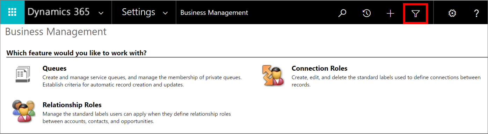
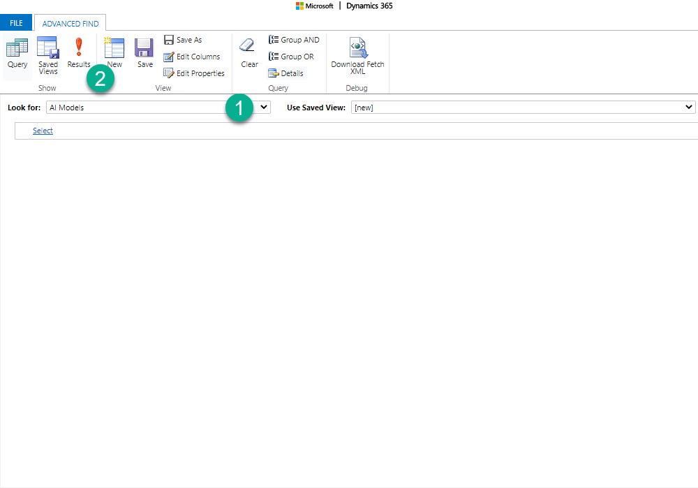
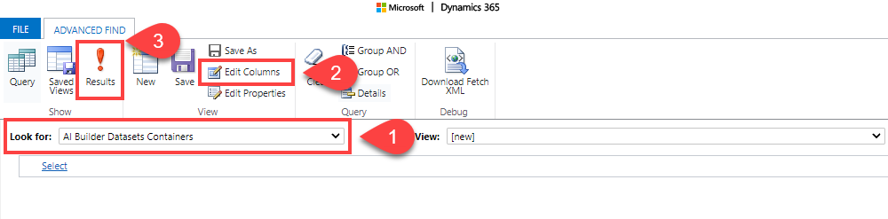
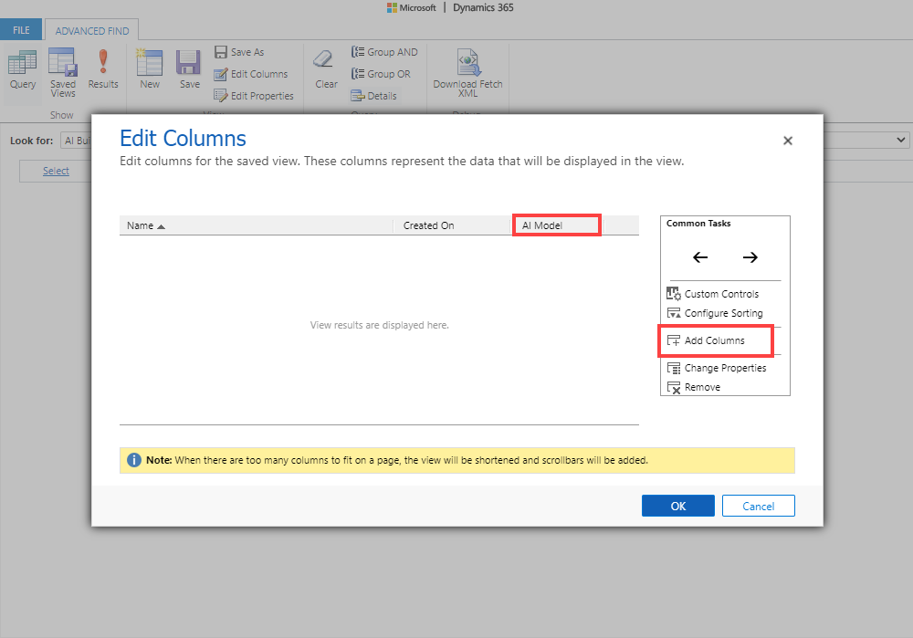

# Share your AI model

When you create and publish AI models in AI Builder, they're private&mdash;only you can run them. This allows you to test them and use them within apps or flows.

If you want other users to use your model in apps or flows, or even use a direct API to make a prediction using your model, you have to share it. This applies to users who create apps or flows that call your model, and also to users who just run those apps or flows. Both app makers and app users need a shared access to your model.

## Share action

The share action is available on the **Models** page in AI Builder for each model where you're the owner. It's also available for the system administrator in the environment, or for any security role that has Share permissions on AI Builder system tables.

The share action is also available on the model detail screen in AI Builder, with the same conditions.

## Share panel

When you select the share action, a share panel is displayed. The share panel is where you select Microsoft Dataverse users and teams in your organization, and share your model with them. Note the following:

- Sharing your model with a user or team gives the user or team the ability to see and run your model.
- Sharing your model doesn't give the user or team permission to edit, retrain, or publish the model.
- Sharing your model doesn't give the user or team access to the data you used to train your model.

## Model list views

The models you create and the models that are shared with you appear in the model list under two different views:

- **My models**
- **Shared with me**

 > [!NOTE]
 > If you're an administrator of the environment, all models in your environment appear in the **Shared with me** view, whether they've been shared or not.

When a model is shared with you, you have user permissions to it. You can use it in apps or flows, but you can't view details or edit the model. No actions are available for models in the **Shared with me** list.

As an admin or owner of a model, you might encounter a model where the only available action is **Delete**.<!--Suggested--> This happens when the model type is no longer supported. It might be that the model type was a preview feature, and the admin [disabled AI Builder preview features](administer.md#enable-or-disable-ai-builder-preview-features).

## FAQ

### Is the sharing step necessary to use an app that includes calls to an AI model? Why is app sharing not enough?

App sharing only allows users to open the app. Things like data access or AI model access are granted separately. AI model access is given through the sharing mechanism. Without it, users can open the app, but the app<!--Suggested--> can't execute a call to the AI model.

### Is the sharing step necessary to allow other environment makers to use my model in their apps?

Yes. Your model isn't listed in the AI model control if it isn't shared with the maker of the app. This helps you control access to your work and decide when to release it.

### The share action wasn't necessary when AI Builder was in preview. What happened?

We added the share action to help with privacy concerns. Now, you can build a model in your environment without fear of its being released prematurely.<!--Suggested-->

### Can I allow other users to edit my model?

Sharing models for editing purposes isn't supported by AI Builder.

However, users with the **System Customizer** role can edit models from other users. This workaround isn't supported by the AI Builder team and you may face unexpected issues.

### The owner of a model has left the company. How can we allow non-admin users to edit this model?

*Prerequisite*: A user with the **System Customizer** role can perform this action.

To learn more about roles, go to [Roles and security](security.md#roles).

Reassign this model to another user. _Reassign_ means changing ownership in the advanced settings of your organization in AI Builder. You also need to give access to the data used to train the model.

To change the ownership of a model:

1.	Sign in to the [Power Platform admin center](https://admin.powerplatform.microsoft.com/).

1. Select the environment where the model you want to change ownership is located.

1. Select **Settings** > **Resources** > **All legacy settings**.

1. Select **Advanced Find** on the top right corner.
    > [!div class="mx-imgBorder"]
    > 
    
1.	From the **Look for** list, select **AI Models**, and then select **Results**.
    > [!div class="mx-imgBorder"]
    > 

1. You'll get a list of the AI models in the environment. Select the model you want to reassign, and select **Assign AI Models**. A window will open where you can change the owner of the model.

If the model you're changing the ownership is a *form processing* model or an *object detection* model, you'll also need to reassign the **AI Builder Datasets Container** associated with the model.

 To reassign **AI Builder Datasets Containers**:

1.	On the **Advanced Find** tab, select **AI Builder Datasets Containers** from the **Look for** list. To make it easier to identify which AI models it corresponds to, select **Edit Columns** > **Add Columns** > **AI Model**. 

    > [!div class="mx-imgBorder"]
    > 

    > [!div class="mx-imgBorder"]
    > 

1.	Select the row associated to the model you're reassigning.

1. Select **Assign AI Builder Datasets Containers**. A window will open where you can change the owner. 

### Can I disable the sharing feature for AI model makers and only allow admins to do it?

Yes. In advanced settings of your organization, an admin must create a security role where the share privilege is disabled for the **AI Model** custom entity. Assign this role to AI model makers.

### Why can't I share generic prediction models?

Generic prediction models only work as part of a scheduled run. They can't be used in Power Apps or Power Automate, so the share action isn't available.

### Next step

[Distribute your AI model](distribute-model.md)

[!INCLUDE[footer-include](includes/footer-banner.md)]
