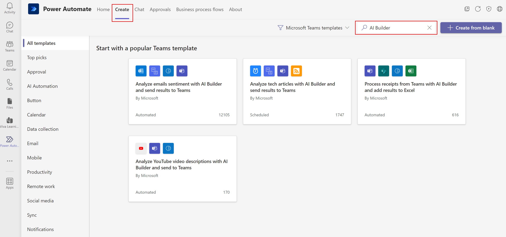
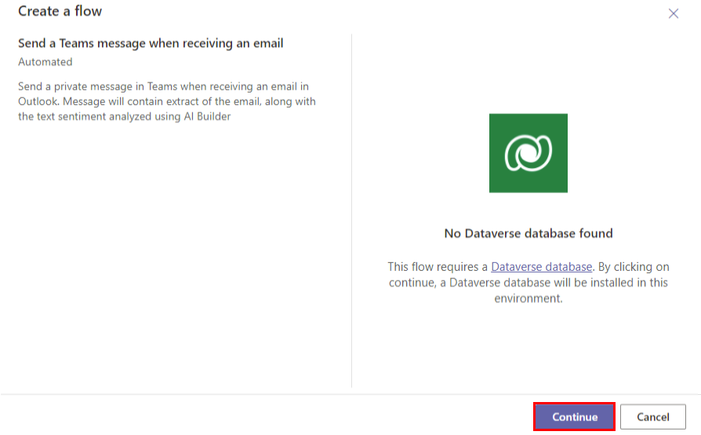
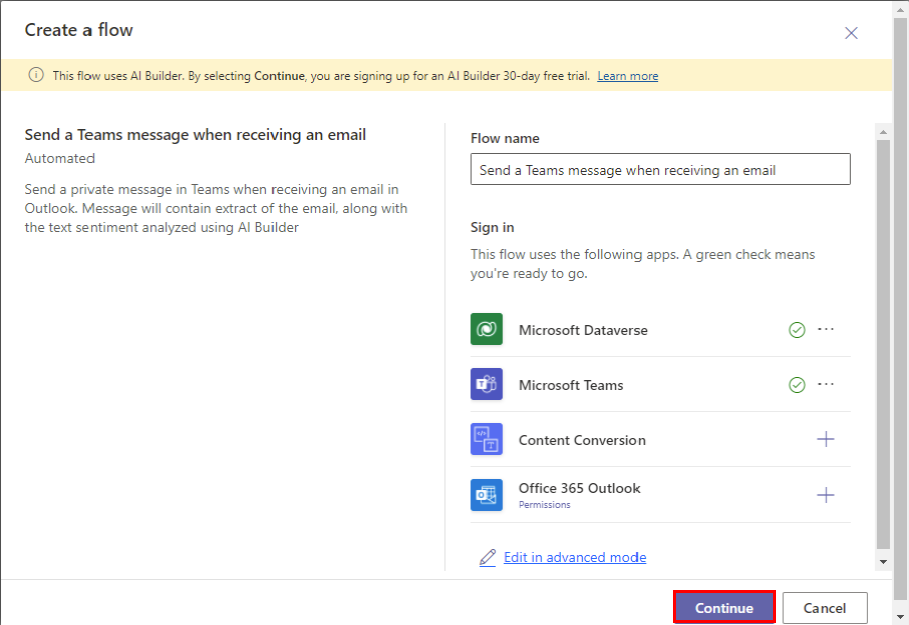

# Use AI Builder templates in Teams

You can use Power Automate templates in Teams that solve a specific business purpose using AI Builder actions.

## Discover AI Builder templates in Teams

1. Go to your Teams app or [Teams web](https://teams.microsoft.com)
1. Click on **Apps** icon on the bottom left
1. Look for the app named **Power Automate** and install it. The app appears on the left menu of Teams. You can pin the app to keep it there when you reopen Teams
1. Click on the Power Automate app and go to **Create** tab. From there you can search for the AI Builder templates listed in the next section of this documentation
    
> [!div class="mx-imgBorder"]
> 

## Create a flow from a template
From the list of AI Builder templates, pick the one that fits the most to your business case. If you don't have Microsoft Dataverse installed, you will see the following dialog:

> [!div class="mx-imgBorder"]
> 

When clicking on the **Continue** button, Dataverse will be installed. It usually takes couple of minutes (it some particular cases in cas take more than 1h).

If Dataveserse is already installed, you will land on the simplified template experience for Teams. The first screen asks you to validate connections:
 
> [!div class="mx-imgBorder"]
> 

>[!NOTE]
>
>An AI Builder trial will be started or extended if needed. This action will be performed silentely upon clicking on the **Continue** button.

Once all your connections are valid you can click on **Continue**.

This is now time for you to enter the parameters required by the template to create the flow:

 > [!div class="mx-imgBorder"]
 > 

>[!NOTE]
>
>It is also possible to click on "Edit in advanced mode". This will open the full flow editor within Teams. 

Once you filled all the parameters, your can click on **Create flow**. After few seconds, your flow will be created and ready to use.

Created flows are visible and can be modified from the home page of the Power Automate application.

