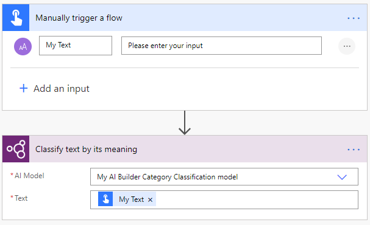
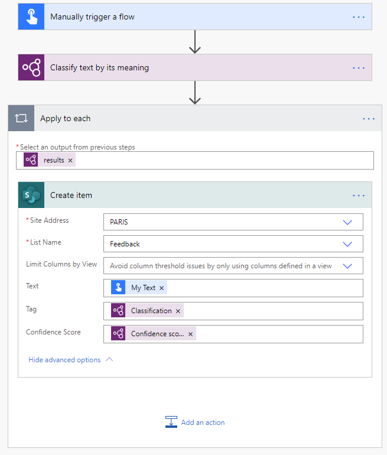

# Use category classification model in Power Automate

[!INCLUDE[cc-beta-prerelease-disclaimer](./includes/cc-beta-prerelease-disclaimer.md)]

> [!IMPORTANT]
 > To use AI Builder models in Power Automate, you have to create the flow inside a solution. The steps below won't work if you don't follow these instructions first: [Create a flow in a solution](/flow/create-flow-solution).

1. Sign in to [Power Automate](https://flow.microsoft.com/), select the **My flows** tab, and then select **New > +Instant-from blank**.
1. Name your flow, select **Manually trigger a flow** under **Choose how to trigger this flow**, and then select **Create**.
1. Expand **Manually trigger a flow**, select **+Add an input**, select **Text** as the input type, and set as input title **My Text**.
1. Select **+ New step**, search for **AI Builder**, and then select **Classify text by its meaning** in the list of actions.
1. Select the category classification model you want to use, and in the **Text** field, add **My Text** from the trigger:

      > [!div class="mx-imgBorder"]
      > 

1. In your flow's successive actions, you can iterate through the outputs returned by the category classification model. The following example, saves each inferred tag into a SharePoint list.

    > [!div class="mx-imgBorder"]
    > 

Congratulations! You've created a flow that uses a category classification AI Builder model. Select **Save** on the top right and then select **Test** to try out your flow.

To learn more about the triggers and actions, see [Get started with Power Automate](/flow/getting-started).

### Related topic

[Category classification model overview](text-classification-overview.md)
