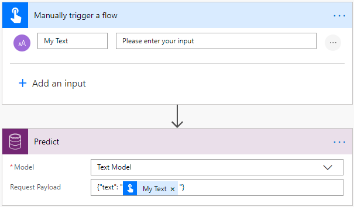
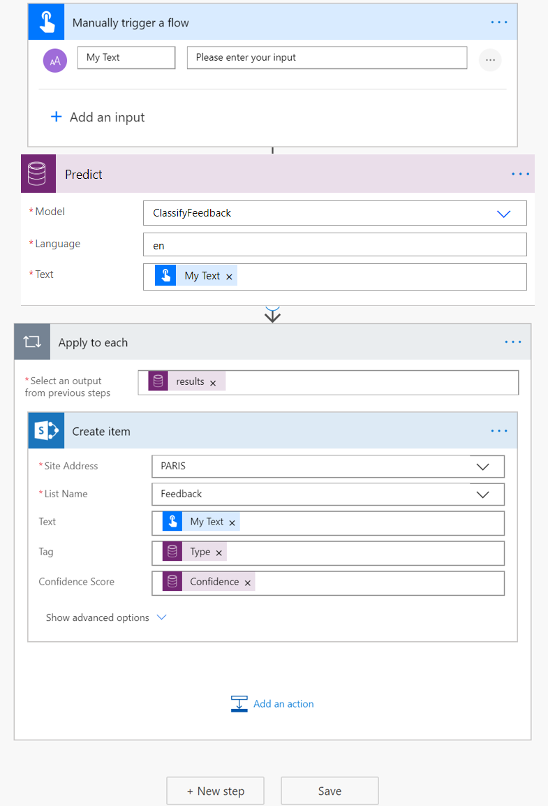

# Use text classification model in Power Automate

[!INCLUDE[cc-beta-prerelease-disclaimer](./includes/cc-beta-prerelease-disclaimer.md)]

> [!IMPORTANT]
 > To use AI Builder models in Power Automate, you have to create the flow inside a solution. The steps below won't work if you don't follow these instructions first: [Create a flow in a solution](/flow/create-flow-solution).

1. Sign in to [Power Automate](https://flow.microsoft.com/), select the **My flows** tab, and then select **Create from blank**.

1. Search for *manually*, select **Manually trigger a flow** in the list of triggers, and then select **+Add an input**.
1. Select **Text** and set as input title: **My Text**
1. Select **+ New step**, search for **Predict**, and then select **Predict Common Data Service (current Environment)** in the list of actions.
    >[!NOTE]
    > **Predict Common Data Service (current Environment)** does not appear if you don't follow these instructions first: [Create a flow in a solution](/flow/create-flow-solution)
1. Select the text classification model you want to use, and in the **Text** field, add **My Text** from the trigger:

    > [!div class="mx-imgBorder"]
    > 

1. In your flow's successive actions, you can iterate through the outputs returned by the text classification model. The following example, saves each inferred tag into a SharePoint list.

    > [!div class="mx-imgBorder"]
    > 

Congratulations! You've created a flow that uses a text classification AI Builder model. Select **Save** on the top right and then select **Test** to try out your flow.

To learn more about the triggers and actions, see [Get started with Power Automate](/flow/getting-started).

### Related topic

[Text classification model overview](text-classification-overview.md)
