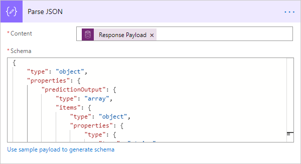
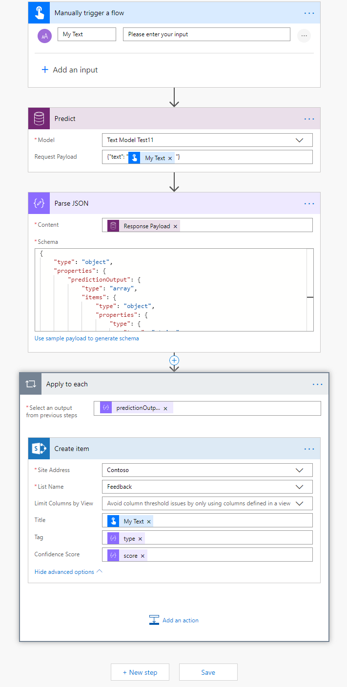

# Use text classification model in Power Automate

[!INCLUDE[cc-beta-prerelease-disclaimer](./includes/cc-beta-prerelease-disclaimer.md)]

> [!IMPORTANT]
 > To use AI Builder models in Power Automate, you have to create the flow inside a solution. The steps below won't work if you don't follow these instructions first: [Create a flow in a solution](/flow/create-flow-solution).

1. Sign in to [Power Automate](https://flow.microsoft.com/), select the **My flows** tab, and then select **Create from blank**.
2. Search for *manually*, select **Manually trigger a flow** in the list of triggers, and then select **+Add an input**.
3. Select **Text** and set as input title: **My Text**
4. Select **+ New step**, search for **Predict**, and then select **Predict Common Data Service (current Environment)** in the list of actions.
5. Select the text classification model you want to use, and in the **Request Payload** field, enter **{“text”:”My Text”}**. Add the **My Text** field from the trigger:

    > [!div class="mx-imgBorder"]
    > 

6. Select **+ New step**, search for **Parse JSON**, and then select **Parse JSON – Data Operations** in the lists of actions.
7. In the **Content** field, select **Response Payload**.
8. Copy the following JSON code and paste it into the **Schema** box:

    ```json
      {
          "type": "object",
          "properties": {
              "predictionOutput": {
                  "type": "object",
                  "properties": {
                      "results": {
                          "type": "array",
                          "items": {
                              "type": "object",
                              "properties": {
                                  "type": {
                                      "type": "string"
                                  },
                                  "score": {
                                      "type": "number"
                                  }
                              },
                              "required": [
                                  "type",
                                  "score"
                              ]
                          }
                      }
                  }
              },
              "operationStatus": {
                  "type": "string"
              },
              "error": {}
          }
      }
    ```
    
    > [!div class="mx-imgBorder"]
    > 

9. Now you can iterate through the outputs returned by the text classification model. In the following example, we save each inferred tag into a SharePoint list.

   > [!div class="mx-imgBorder"]
   > 

Congratulations! You have created a flow that leverages a text classification AI Builder model. Select **Save** on the top right and then select **Test** to try out your flow.

To learn more about the triggers and actions, see [Get started with Power Automate](/flow/getting-started).

### Related topic

[Text classification model overview](text-classification-overview.md)
