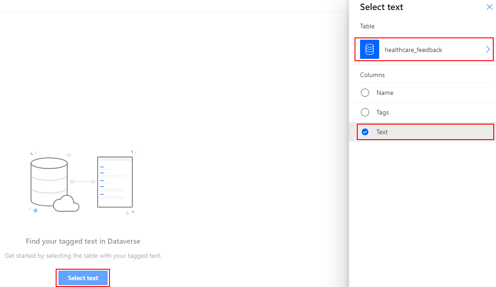
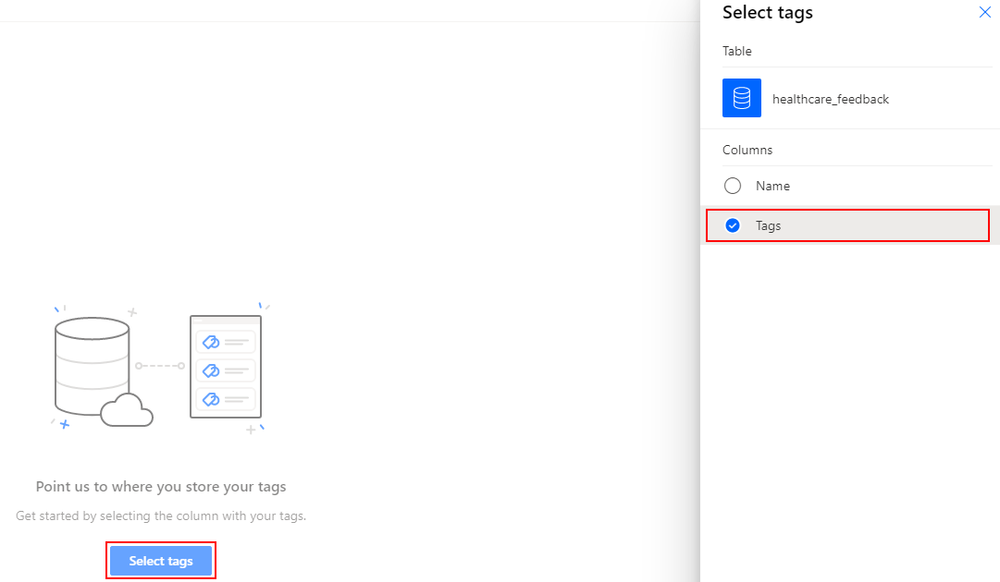

# Use sample data to do category classification

Get started exploring AI Builder category classification by using sample data to build and train a category classification model. The sample data uses customer feedback for a hospital. The goal is to train a model that can predict the category of newly received feedback. This model can help the hospital administrator free up time from categorizing patient feedback, leaving more time to act on it and provide a better experience to patients.

> [!NOTE]
> This sample data is added to your environment automatically if you enable the [Deploy sample apps and data](build-model.md#deploy-sample-apps-and-data) setting when creating your database.

## Set up an environment with data

1. Download [AIBuilder_Lab.zip](https://go.microsoft.com/fwlink/?linkid=2103171), which contains category classification sample data.

    > [!NOTE]
    > The AIBuilder_Lab.zip file also contains sample files for working with other AI Builder model types, in addition to some hands-on labs that you can use to learn more about AI Builder. For more information about the contents of the zip file, see the [readme.txt](https://go.microsoft.com/fwlink/?linkid=2108226) file that's included in the zip file.<!--By the way, this readme file needs some work. Please see learn-ai-builder.md for my markup.-->

2. Import the **AIBuildetTextSample_1_0_0** solution to your Microsoft Dataverse environment. More information: [Import, update, and export solutions](/powerapps/maker/common-data-service/import-update-export-solutions)

3. Go to Lab Data/Text Classification folder within the lab files and then upload data from pai_healthcare_feedbacks. 

## Create your model

1. Go to the AI Builder build screen, and select **Category classification**.
2. Enter a name, and then create your model.
3. Choose **Select text**, pick the **healthcare_feedback** table, and then select the **text** column.

    > [!div class="mx-imgBorder"]
    > 

1. Choose **Select column**, preview the tagged text, and then select **Next**.
1. Choose **Select tags** and then select the **tags** column.

    > [!div class="mx-imgBorder"]
    > 

1. Choose **Select column**, verify that the correct separator (comma) is chosen, and then select **Next**.
1. Review your text and tags, and select **Next**.
1. Select **English** as the text language, and then select **Next**.
1. Review the model summary, and then select **Train** to train your model.

[!INCLUDE[footer-include](includes/footer-banner.md)]
