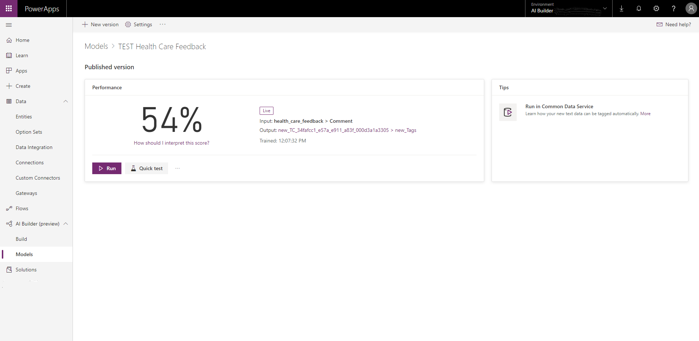

# View generated predictions

[!INCLUDE[cc-beta-prerelease-disclaimer](./includes/cc-beta-prerelease-disclaimer.md)]

In this section we show you how to view the output of your prediction model.
 
1.	After you publish your model, the output location appears in the **Performance** section.
    

    The name shown in **Output** in the **Performance** section is the name of the entity and attribute that is created after publishing. It is a link that takes you to the entity viewer section where the new fields that are added by AI Builder appear. 
 
2.	In the **Views** section, view the values of the output fields for the different records. Use the **Filter by** function in the lower right-side pane to filter for only the records that do not have a label.
3.	Next, you can build a simple model-driven app to consume the output. For information about how to build a model driven app in PowerApps, go to the [model-driven app overview](/powerapps/maker/model-driven-apps/model-driven-app-overview) topic in PowerApps docs.

### Next steps
[Use generated tage](text-classification-model-use-tags.md) 
