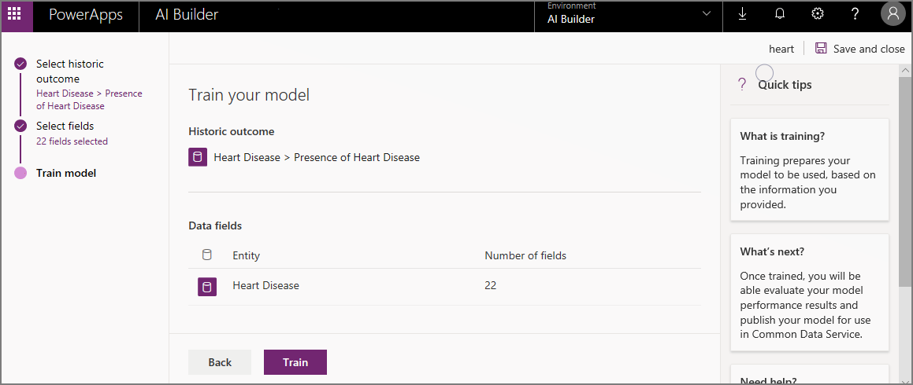

# Train your model in AI Builder

Before you can use your AI model, you have to train it to perform the way you want. After you train your model, [publish it](publish-model.md) to make it available to other people.

When you create a model in AI Builder, you configure it based on the needs of your business. Each time you save changes to your model in AI Builder, AI Builder saves your progress as a draft. When you're done, confirm the settings with which you want to train your model, and then select **Train** to begin training.

> [!div class="mx-imgBorder"]
> 

> [!NOTE]
> Training takes time, so you can stay on the page and wait, or you can close the page and come back later.

After you train your model for the first time, you have access to a details page where you can [manage your model](manage-model.md) and&mdash;for some model types&mdash;view the model's performance results.

On the details page, training results appear in the **Last trained version** section.

### Next steps

- [Manage your model in AI Builder](manage-model.md)
- [Publish your model in AI Builder](publish-model.md)

[!INCLUDE[footer-include](includes/footer-banner.md)]