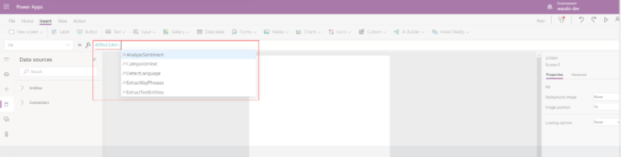

# Use formulas for text AI models (preview)

You can integrate some AI Builder models in [Power Apps Studio](https://create.powerapps.com) by using the formula bar. Currently, this functionality is available only for the following AI Builder model types:

* [Sentiment analysis](#sentiment-analysis)
* [Entity extraction](#entity-extraction)
* [Key phrase extraction](#key-phrase-extraction)
* [Language detection](#language-detection)
* [Category classification](#category-classification)

 > [!NOTE]
 > To improve the prediction score of the text AI models listed above and to narrow down the language in which they are interpreted, you can provide language code as an additional parameter. The language code needs to be provided in IETF [BCP-47 format](/openspecs/office_standards/ms-oe376/6c085406-a698-4e12-9d4d-c3b0ee3dbc4a).
> 
> For a complete list of languages supported for these models, see [Text Analytics v3 language support](/azure/cognitive-services/text-analytics/language-support?tabs=sentiment-analysis).

**Example**:

If you want, you can select the **Label** control, enter **AIBuilder**, and try out the various AI models, using **TextInput1** as the text. <!-- Angie: Verify this screenshot. -->

> [!div class="mx-imgBorder"]
> 

## Sentiment analysis

The formula in the sentiment analysis model returns the sentiment of the text, such as negative or positive.

### Formula examples

- **AIBuilder.AnalyzeSentiment(TextInput1.Text).sentiment**

- To ensure the text is interpreted in context of a specific language, you can provide the language code in IETF [BCP-47 format](/openspecs/office_standards/ms-oe376/6c085406-a698-4e12-9d4d-c3b0ee3dbc4a):

   **AIBuilder.AnalyzeSentiment(TextInput1.Text,{language:"en-us"}).sentiment**

   In this example, **en-us** is the language code of English (United States).

## Entity extraction

The formula in the entity extraction model extracts the types of entities present in the text into a list.

### Formula examples

- **Concat(AIBuilder.ExtractTextEntities(TextInput1.Text).entities, type & ", ")**

- The following formula uses your custom AI Builder model to return all entities that belong to the text, in list form:

   **Concat(AIBuilder.ExtractTextEntities CategorizeText(TextInput1.Text, { modelId: GUID("<yourModelId>").entities, type & ",")**

- Use specific language to interpret the text and return all types of entities into a list:

   **Concat(AIBuilder.ExtractTextEntities(TextInput1.Text,{language:"en-us"}).entities, type & ", ")**

   In this example, **en-us** is the language code of English (United States).

For a complete list of language code in IETF, see [BCP-47 format](/openspecs/office_standards/ms-oe376/6c085406-a698-4e12-9d4d-c3b0ee3dbc4a).

## Key phrase extraction

The formula in the key phrase extraction model extracts all key phrases from the text into a list.

### Formula examples

- **Concat(AIBuilder.ExtractKeyPhrases(TextInput1.Text).phrases, phrase & ",")**

- Use specific language and extract all key phrases from the text into a list:

   **Concat(AIBuilder.ExtractKeyPhrases(TextInput1.Text, ,{language:"en-us"}).phrases, phrase & ",")**

   In this example, **en-us** is the language code of English (United States).

For a complete list of language code IETF, see [BCP-47 format](/openspecs/office_standards/ms-oe376/6c085406-a698-4e12-9d4d-c3b0ee3dbc4a).

## Language detection

The formula in the language detection model returns the two-letter language code (ISO 639) of the text.

### Formula examples

- **AIBuilder.DetectLanguage(TextInput1.Text).language**

   |Text  |Language  |
   |---------|:---------:|
   |How are you    |    en     |
   |Comment allez-vous    |    fr     |

- To narrow down the prediction in context of a specific country, provide the country code in ISO-3166 format:

   **AIBuilder.DetectLanguage(TextInput1.Text,{countryHint:"DK"}).language**  

   In this example, country **DK** refers to the ISO-3166 country code for Denmark.

- If you provide **hvordan har du det** in **textinput1**, it returns **da** which is the language code for Danish. Without country code provided it would return **no**, which is the language code for Norwegian where this text is also valid.

- The following example returns the confidence score of the detected language. This returns a number in the range of 0 to 1. The greater the value, the higher the confidence is in the predictions made by the AI model.

   **AIBuilder.DetectLanguage(TextInput1.Text).score**  

## Category classification

The formula in the category classification model returns all categories that belong to the text, in list form.

- **Concat(AIBuilder.CategorizeText (TextInput1.Text).categories , type & ",")**

- This formula uses your custom AI Builder model to return all categories that belong to the text, in list form:

   **Concat(AIBuilder.CategorizeText(TextInput1, { modelId: GUID("<yourModelId>").categories, type & ",")Concat( AIBuilder.CategorizeText(TextInput1.Text ,{modelId:GUID("<your model id>" )}).categories,type,",")**

- This formula uses English (United States) as the language for interpretation to return all categories that belong to the text, in list form:

   **Concat( AIBuilder.CategorizeText(TextInput1.Text ,{language:"en-us"}).categories,type,","));**

### See also <!-- Angie: is this needed? -->