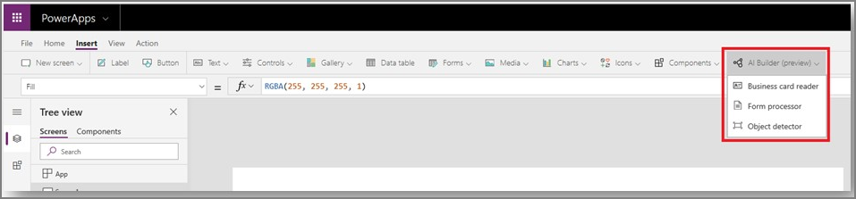

# AI Builder in PowerApps overview

[!INCLUDE[cc-beta-prerelease-disclaimer](./includes/cc-beta-prerelease-disclaimer.md)]

AI Builder comes with:
- A ready-to-use business card reader available in canvas as well as in [model-driven apps](/powerapps/maker/model-driven-apps/model-driven-app-overview). 
- Additional canvas components to leverage your AI Builder form processing or object detection models in PowerApps [canvas apps](/powerapps/maker/canvas-apps/getting-started). These components are available in the canvas studio.

> [!div class="mx-imgBorder"]
> 

The canvas components appear in the **Insert** tab when you build your canvas app in PowerApps.

Three components are available in canvas:

 - [Business card reader](business-card-reader-component-in-powerapps.md)
 - [Form processor](form-processor-component-in-powerapps.md)
 - [Object detector](object-detector-component-in-powerapps.md)

One is available in model-driven:
- [Business card reader](business-card-reader-component-model-driven.md)
