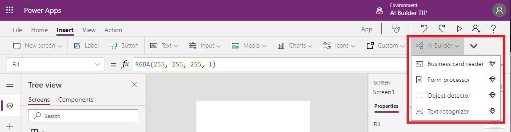

# AI Builder in Power Apps overview

[!INCLUDE[cc-beta-prerelease-disclaimer](./includes/cc-beta-prerelease-disclaimer.md)]

AI Builder comes with:
- A ready-to-use business card reader available in canvas as well as in [model-driven apps](/powerapps/maker/model-driven-apps/model-driven-app-overview). 
	- [Business card reader (Canvas)](business-card-reader-component-in-powerapps.md)
	- [Business card reader (Model-driven)](business-card-reader-component-model-driven.md)
- Additional canvas components to leverage your AI Builder form processing or object detection models [canvas apps](/powerapps/maker/canvas-apps/getting-started).
	- [Form processor](form-processor-component-in-powerapps.md)
	- [Object detector](object-detector-component-in-powerapps.md)

> [!div class="mx-imgBorder"]
> 

The canvas components are available in the canvas studio and appear in the **Insert** tab when you build your canvas app in Power Apps.

### Related content

- [Feature availability by region](availability-region.md)
- [AI Builder in Power Automate](use-in-flow-overview.md)
- [Prerequisites](use-in-flow-prereq.md)
