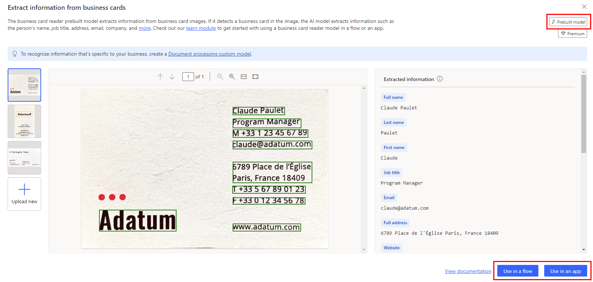

# Use your AI model

After you publish your model, you can use it across Microsoft Power Platform to create end-to-end solutions that meet your business needs.

## Get straight to productivity

When you select a *prebuilt model* from one of the tiles in **Try out AI capabilities for each data type**, you can choose how you want to use the model (in a flow or app), and then AI Builder will provide you with the steps to build it. A prebuilt model tile doesn't have the word **Custom** in the upper-right corner. When you select it, the next screen shows **Prebuilt model** in the upper right. The following example shows the screen for the business card reader model.

> [!div class="mx-imgBorder"]
> 

## Optimize a model for your business outcome

When you select a *custom model* from one of the tiles in **Try out AI capabilities for each data type**, you can customize your own steps. You can learn how your model is used in the detail page.

> [!div class="mx-imgBorder"]
> 

To learn how to use each AI Builder model in Power Automate or Power Apps, select one of the following links for details:

- [Use AI Builder in Power Automate](use-in-flow-overview.md)
- [Use AI Builder in Power Apps](use-in-powerapps-overview.md)

## Next step

[Share your AI model](share-model.md)

[!INCLUDE[footer-include](includes/footer-banner.md)]
