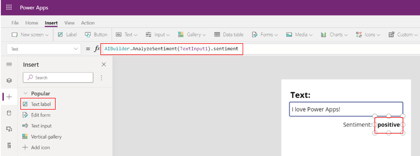
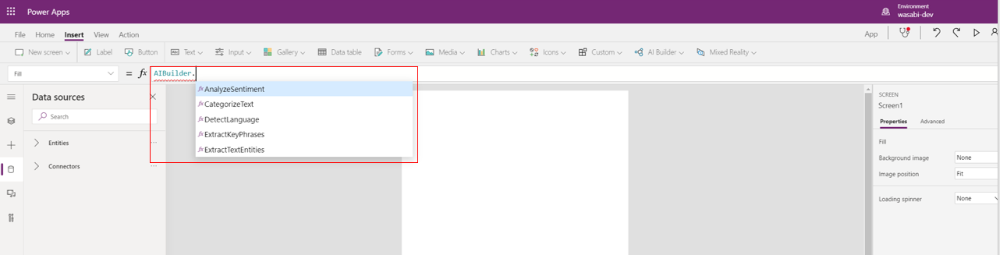
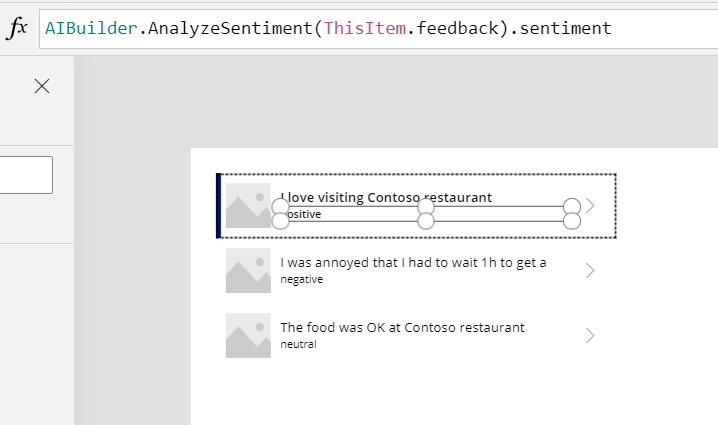

# Use your model

After you publish your model, you can use it across the Power Platform to create end-to-end solutions that meet your business needs. In this topic, you'll learn all of the different ways you can use your model.

After you publish your model, a **Use model** button appears in the **Performance** section. This opens a pane that shows all of the ways you can use your model. These options vary based on your AI model type.

## Set run schedule

Create a schedule to generate predictions regularly in Common Data Service.

View the scheduling options available for your model type:

* [Set a run schedule for your category classification model](/ai-builder/text-classification-model-use-tags#set-run-schedule-on-common-data-service)

> [!NOTE]
> At this time, you can't use the schedule feature to run a category classification model.

## Run now

Generate new predictions right away and save them to Common Data Service.

Learn how to run now for your model type:

* [Run your prediction model](/ai-builder/prediction-train-model#prediction-run)

## Create new app

Insert an AI Builder component to a canvas app. See [AI Builder in Power Apps overview](use-in-powerapps-overview.md).

## Use formulas for text AI models (Preview)

You can integrate some AI Builder models in [Power Apps Studio](https://create.powerapps.com) by using the formula bar. Currently, this functionality is available only for the following AI Builder model types:

* Sentiment analysis
* Entity extraction
* Key phrase extraction
* Language detection

 Category classification

For information about this functionality becoming available with other model types, see [Release plans](/power-platform-release-plan/2019wave2/ai-builder/planned-features)

 > [!IMPORTANT]
 >
 >* This is a preview feature. [!INCLUDE [cc-preview-features-definition](includes/cc-preview-features-definition.md)]
 >
 >* [Data Loss Prevention (DLP) policies](/power-platform/admin/wp-data-loss-prevention) that apply to Common Data Service also apply to AI Builder.
 >
 >* To use formulas in an app that was created before May 7, 2020, go to **Settings > Advance Settings > Preview Features** and set **AI Builder formulas** to **ON**. This step is not necessary for newly created apps.

To enable or disable this feature (for example, for Data Loss Prevention), see **AI Builder formulas** under **Advanced Settings**: [Controlling which features are enabled](/powerapps/maker/canvas-apps/working-with-experimental-preview#controlling-which-features-are-enabled.md)

When you type “AIBuilder” in an app, it may take a few seconds to load it functions. Once it loads, type “.” to view the available functions. Detailed information about how to use formulas in canvas apps is available here: [Get started with canvas-app formulas in Power Apps](/powerapps/maker/canvas-apps/working-with-formulas.md)

### Example: Sentiment analysis

In this example we use a **Text Input** control and a **Label** control to invoke sentiment analysis.

1. Sign in to Power Apps Studio (<https://create.powerapps.com>).

1. Insert a **Text Input** control, select it, select **Advanced Properties**, change **DelayOutput** to true. The **Text Input** in this case contains the text we want to analyze.

1. Insert a **Label** control and type the AI Builder formula as shown in the image below. The results of sentiment analysis will automatically appear in **Label** control after you apply the AI Builder formula.

    > [!div class="mx-imgBorder"]
    > 

1. If you want, you can select the **Label** control, type ‘AIBuilder.’ and try out the various formulas (there are five in total), using TextInput1 as the text

    > [!div class="mx-imgBorder"]
    > 

### Available formulas

|Formula|Description|
|:-----|:-----|
AIBuilder.AnalyzeSentiment(TextInput1).sentiment|Returns sentiment of the text, such as negative or positive
Concat(AIBuilder.CategorizeText (TextInput1).categories , type & ",")|Returns all categories that belong to the text, in list form
Concat(AIBuilder.CategorizeText(TextInput1, { modelId: GUID(“<yourModelId>”).categories, type & ",")|Uses your custom AI Builder model to returns all categories that belong to the text, in list form
AIBuilder.DetectLanguage(TextInput1).language|Returns two-letter language code (ISO 3166) of the text
Concat(AIBuilder.ExtractKeyPhrases(TextInput1).phrases, phrase & ",")|Extracts all key phrases from the text into a list
Concat(AIBuilder.ExtractTextEntities(TextInput1).entities, type & ", ")|Extracts the types of entities present in the text into a list

### Example: Use formulas in a gallery control

Some AI models like key phrase or entity extraction, return more than one result. You could use a gallery control to display results of this type of AI Builder model.  

To do this:

1. Insert a gallery control to your canvas app

1. To populate gallery with sample text, while having gallery control selected copy paste this text into the formula bar:

   > Table({feedback: "I love visiting Contoso restaurant"}, {feedback: "I was annoyed that I had to wait 1h to get a table at Contoso restaurant"}, {feedback: "The food was OK at Contoso restaurant"})
   
1. Select the label control within gallery control and type the formula shown here:

    > [!div class="mx-imgBorder"]
    > 

## Next step

[Share your AI Builder model](share-model.md)

### Related topics

[Use AI Builder in Power Automate](use-in-flow-overview.md)  
[Use AI Builder in Power Apps](use-in-powerapps-overview.md)
