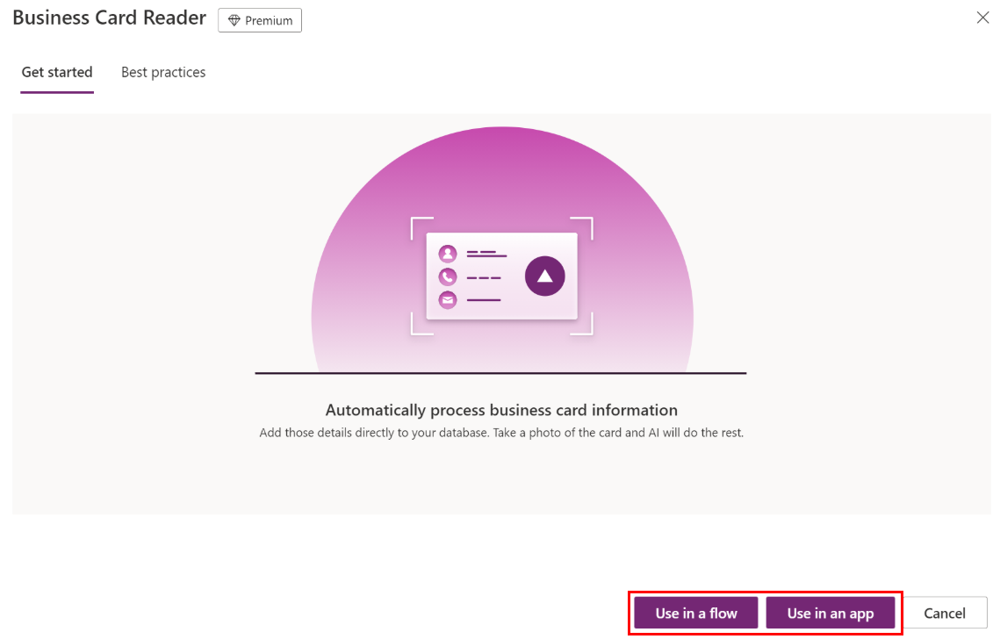

# Use your AI model

After you publish your model, you can use it across Microsoft Power Platform to create end-to-end solutions that meet your business needs.

## Get straight to productivity

When you select a model from **Get straight to productivity**, you can choose  how you want to use the model and then AI Builder will provide you with the steps to build it:

> [!div class="mx-imgBorder"]
> 

## Optimize a model for your business outcome

Unlike a prebuilt model, a custom model allows you to customize your own steps. You can see how your model is used in the detail page:

> [!div class="mx-imgBorder"]
> 

For details on how to use each AI Builder model in Power Automate or Power Apps, select one of the following:

- [Use AI Builder in Power Automate](use-in-flow-overview.md)
- [Use AI Builder in Power Apps](use-in-powerapps-overview.md)

### Next step

[Share your AI model](share-model.md)

[!INCLUDE[footer-include](includes/footer-banner.md)]